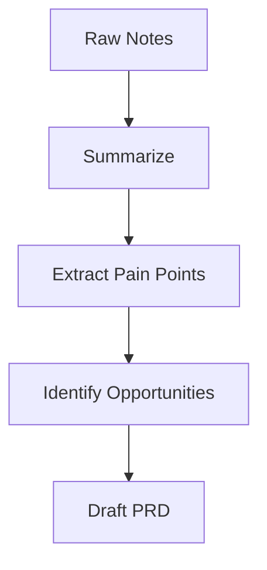
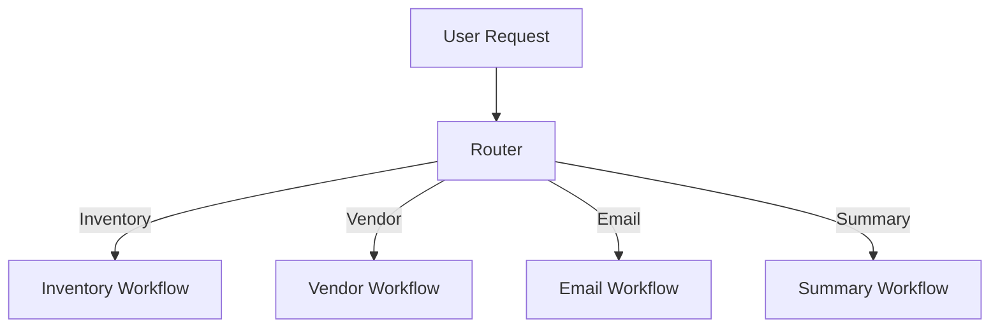
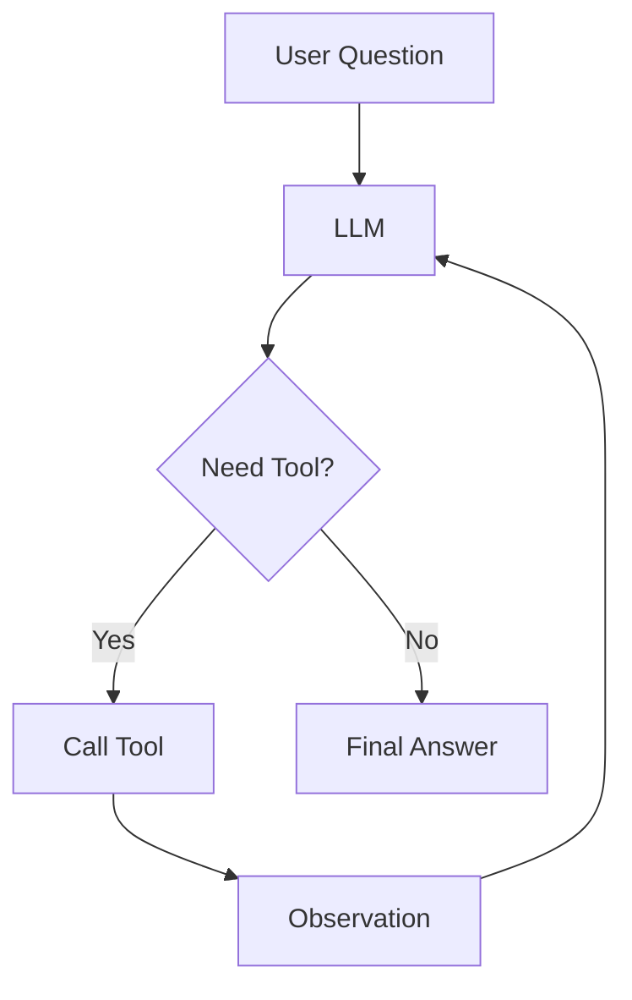

There is a strange thing that happens once a technical idea becomes popular.

The word starts getting used for everything.

That is exactly what happened with **AI agents**.

A simple chatbot is called an agent. A workflow with three prompts is called an agent. A system that calls an API is called an agent. A fully autonomous research assistant that plans, searches, writes, validates, and retries is also called an agent.

Technically, people are not always wrong.

But the problem is that the word **agent** becomes so broad that it stops being useful.

When someone says, “We are building an AI agent,” my first question is no longer, “Cool, what model are you using?”

My first question is:

> What kind of agent?

Because the type of agent determines almost everything else:

- How much autonomy the system has
- How predictable the output will be
- How easy it is to debug
- How expensive it will be to run
- How much risk it introduces
- Whether it belongs in production at all

This is where I think the conversation around agents needs to become more grounded.

Agents are not one thing. They are a spectrum.


At one end, you have controlled workflows where the developer decides almost everything. At the other end, you have open-ended systems where the model decides what to do next, what tools to use, when to retry, and when the task is finished.

Both can be useful.

Both can also fail badly if you use them in the wrong place.

So in this post, I want to break down the agent types that actually matter when you are designing real systems.

Not in a textbook way.

In a practical way.

The way you would think about them if you had to build one, debug one, explain one, or decide whether one belongs in your product.

---

## First, What Do We Mean by an Agent?

Before talking about agent types, we need a working definition.

Here is the simplest version:

> An AI agent is a system where a language model helps decide what action to take next.

That action might be simple:

- Answer the user
- Call a tool
- Search a database
- Ask for clarification
- Summarize a document

Or it might be complex:

- Break a goal into steps
- Execute those steps
- Evaluate the result
- Retry if something failed
- Store useful information for later

The important point is this:

> The more the model decides, the more “agentic” the system becomes.

That gives us a useful mental model.

A normal LLM call is not very agentic. You give it input, it gives output.

A workflow that uses an LLM at predefined steps is a little more agentic.

A tool-using system is more agentic because the model can choose actions.

A planning system is even more agentic because the model decides the sequence of actions.

A self-improving or goal-driven system is highly agentic because it can keep operating across multiple steps with less human direction.

That sounds powerful.

It is.

But power is not automatically good.

In software systems, uncontrolled power often becomes unpredictability.

And unpredictability is where production systems go to die.

---

## Type 1: Prompt-Chained Workflows

Let’s start with the simplest form.

This is the thing many people call an agent, even though it is closer to a workflow.

A **prompt-chained workflow** is a system where multiple LLM calls happen in a fixed sequence.

The developer decides the steps. The model performs each step.

For example, imagine you are building a customer feedback analyzer.

The user uploads 500 product reviews.

Your workflow might look like this:

1. Summarize the reviews
2. Extract common complaints
3. Group complaints into themes
4. Generate product recommendations
5. Write an executive summary

This feels intelligent because an LLM is involved at every step.



But the system itself is not really deciding what to do.

The path is fixed.

The model is not asking, “Should I extract complaints first or cluster themes first?”

It is simply following the chain you designed.

That is not a bad thing.

In fact, this is often exactly what you want.

### Real-world example

Suppose you are building an internal PM tool that takes messy customer notes and turns them into a product brief.

A simple workflow might be:

```text
Raw notes
  → Clean and summarize
  → Extract customer pain points
  → Identify product opportunities
  → Draft PRD outline
```

This is extremely useful.

It saves time. It creates structure. It reduces blank-page anxiety.

But it is not a fully autonomous agent.

It is a controlled pipeline with LLM-powered steps.

And honestly, that is a good place to start.

### Code example: simple prompt chain

```python
from openai import OpenAI

client = OpenAI()


def call_llm(prompt: str) -> str:
    response = client.responses.create(
        model="gpt-4.1-mini",
        input=prompt,
    )
    return response.output_text


def summarize_notes(notes: str) -> str:
    return call_llm(f"""
    Summarize the following customer notes clearly.

    Notes:
    {notes}
    """)


def extract_pain_points(summary: str) -> str:
    return call_llm(f"""
    Extract the main customer pain points from this summary.
    Return them as a numbered list.

    Summary:
    {summary}
    """)


def draft_product_brief(pain_points: str) -> str:
    return call_llm(f"""
    Using these customer pain points, draft a simple product brief.
    Include problem, target user, proposed solution, and risks.

    Pain points:
    {pain_points}
    """)


notes = """
Customers say onboarding takes too long. Several users are confused by the setup screen.
Enterprise admins want better visibility into team-level usage.
Some users also mentioned that documentation is hard to find.
"""

summary = summarize_notes(notes)
pain_points = extract_pain_points(summary)
brief = draft_product_brief(pain_points)

print(brief)
```

### When this type works well

Prompt chains are great when the task is known and repeatable.

They work well for:

- Document transformation
- Summarization pipelines
- Report generation
- Data extraction
- Structured writing workflows
- Internal productivity tools

### Where this type breaks

The weakness is flexibility.

If the input does not fit the expected shape, the workflow may still keep going.

That can create nonsense output.

For example, if the user uploads a legal contract instead of customer notes, the system may still try to extract product pain points because that is what the workflow says to do.

The workflow does not know it is on the wrong path unless you explicitly add checks.

This is why prompt chains often need **gate checks**.

Before step two, ask:

> Is this actually customer feedback?

Before generating a PRD, ask:

> Is there enough information to justify a product recommendation?

That is where simple workflows start evolving toward more agentic systems.

---

## Type 2: Router Agents

A router agent makes a decision about where the request should go.

It does not necessarily complete the whole task itself.

Its job is to classify the user’s intent and route the request to the right workflow, tool, or specialist.

This sounds boring.

It is not.

Routing is one of the most useful agent patterns in real products.

Imagine a support assistant for a SaaS product.

A user might ask:

> “Why was I charged twice?”

Another user might ask:

> “How do I invite a teammate?”

Another might ask:

> “Can you cancel my account?”

These should not go through the same flow.

The billing question may need account lookup.

The teammate question can be answered from documentation.

The cancellation request may need a retention workflow or human handoff.

A router agent decides which path to take.

### Real-world example

Let’s say you are building an AI assistant for an e-commerce operations team.

The assistant receives questions like:

- “Why is SKU P005 out of stock?”
- “Show me vendors with late shipments this month.”
- “Draft an email to the supplier asking for updated ETA.”
- “Summarize today’s inventory risk.”

A router can classify these into categories:

```text
inventory_lookup
vendor_performance
email_draft
executive_summary
unknown
```

Once routed, each category can have a controlled workflow behind it.



That is a strong architecture because you get some flexibility without giving the model unlimited freedom.

### Code example: router agent

```python
from openai import OpenAI
import json

client = OpenAI()

ROUTES = [
    "inventory_lookup",
    "vendor_performance",
    "email_draft",
    "executive_summary",
    "unknown",
]


def route_request(user_message: str) -> dict:
    prompt = f"""
    You are a routing agent for an operations assistant.

    Classify the user request into one of these routes:
    {ROUTES}

    Return only valid JSON with this structure:
    {{
      "route": "one_of_the_routes",
      "reason": "brief explanation"
    }}

    User request:
    {user_message}
    """

    response = client.responses.create(
        model="gpt-4.1-mini",
        input=prompt,
    )

    return json.loads(response.output_text)


def handle_request(user_message: str):
    decision = route_request(user_message)
    route = decision["route"]

    if route == "inventory_lookup":
        return "Calling inventory lookup workflow..."
    elif route == "vendor_performance":
        return "Calling vendor performance workflow..."
    elif route == "email_draft":
        return "Calling email drafting workflow..."
    elif route == "executive_summary":
        return "Calling summary workflow..."
    else:
        return "I need more information before I can help."


print(handle_request("Why is SKU P005 out of stock?"))
```

### Why router agents are underrated

A lot of teams jump straight to highly autonomous agents.

But a router is often enough.

It gives the system decision-making power at one specific point:

> Which path should this request take?

That is much safer than allowing the model to decide every step.

In production, this matters.

You usually do not want the model inventing a new workflow every time.

You want it to choose from approved workflows.

That is a router agent.

---

## Type 3: Tool-Using Agents

This is the agent type most people are talking about when they say “agent.”

A tool-using agent can decide when to call external tools.

The tool might be:

- A calculator
- A search API
- A database lookup
- A calendar API
- A CRM system
- A file reader
- A code interpreter
- A weather API

The key shift is this:

> The LLM is no longer only generating text. It is deciding when it needs help from the outside world.

That is a big deal.

A normal LLM can answer from its training data and context.

A tool-using agent can interact with live systems.

It can retrieve current data.

It can perform actions.

It can use results from one step to decide the next step.

### Real-world example

The classic example is:

> “What time is my dentist appointment tomorrow?”

A regular LLM should not guess.

A tool-using agent can reason:

```text
I need calendar data.
Call calendar_search(date="tomorrow", query="dentist")
Read result.
Answer user.
```

This is the point where the system starts to feel meaningfully agentic.

### Simple tool-calling example

Below is a simplified example. We define tools in normal Python, then let the model decide which one should be used.

```python
import json
from openai import OpenAI

client = OpenAI()


def get_inventory_status(sku: str) -> dict:
    fake_inventory = {
        "P005": {"stock": 0, "status": "out_of_stock", "next_delivery": "2026-05-03"},
        "P010": {"stock": 42, "status": "in_stock", "next_delivery": None},
    }
    return fake_inventory.get(sku, {"error": "SKU not found"})


def get_vendor_status(sku: str) -> dict:
    fake_vendor_data = {
        "P005": {"vendor": "Acme Supply", "last_shipment_delay_days": 6, "reason": "customs delay"},
        "P010": {"vendor": "Northstar Goods", "last_shipment_delay_days": 0, "reason": None},
    }
    return fake_vendor_data.get(sku, {"error": "SKU not found"})


tools = [
    {
        "type": "function",
        "name": "get_inventory_status",
        "description": "Get current inventory status for a SKU.",
        "parameters": {
            "type": "object",
            "properties": {
                "sku": {"type": "string"}
            },
            "required": ["sku"]
        }
    },
    {
        "type": "function",
        "name": "get_vendor_status",
        "description": "Get vendor shipment status for a SKU.",
        "parameters": {
            "type": "object",
            "properties": {
                "sku": {"type": "string"}
            },
            "required": ["sku"]
        }
    }
]

available_tools = {
    "get_inventory_status": get_inventory_status,
    "get_vendor_status": get_vendor_status,
}

response = client.responses.create(
    model="gpt-4.1-mini",
    input="Why is SKU P005 out of stock?",
    tools=tools,
)

for item in response.output:
    if item.type == "function_call":
        tool_name = item.name
        args = json.loads(item.arguments)
        result = available_tools[tool_name](**args)
        print("Tool result:", result)
```

In a full implementation, you would pass the tool result back to the model and ask it to produce the final user-facing answer.

The important architecture looks like this:



```text
User asks question
  → Model decides tool is needed
  → System executes tool
  → Tool result returns as observation
  → Model writes final answer
```

### Why tool-using agents are powerful

They solve one of the biggest limitations of LLMs:

> LLMs do not automatically know the current state of your business.

They do not know today’s inventory.

They do not know your calendar.

They do not know which vendor missed the last shipment.

They do not know what happened in your CRM this morning.

Tools bridge that gap.

### Where tool-using agents fail

Tool-using agents can fail in several ways.

They may call the wrong tool.

They may call the right tool with the wrong arguments.

They may ignore the tool result.

They may over-trust a bad tool result.

They may call tools unnecessarily and increase cost or latency.

So tool use needs guardrails.

A production-grade tool-using agent usually needs:

- Tool descriptions that are very clear
- Strict schemas
- Input validation
- Permission checks
- Logging
- Retry logic
- Human approval for risky actions

The model can decide, but the system should still control what is allowed.

That distinction matters.

---

## Type 4: ReAct Agents

ReAct stands for **Reason + Act**.

The idea is simple:

The model alternates between reasoning and taking actions.

It does not just call a tool once. It can go through a loop.

A typical ReAct pattern looks like this:

```text
Thought: I need to know the current inventory.
Action: get_inventory_status("P005")
Observation: stock is 0, next delivery is May 3.
Thought: I should check vendor delay details.
Action: get_vendor_status("P005")
Observation: vendor shipment delayed by customs.
Thought: I have enough information.
Final Answer: SKU P005 is out of stock because...
```

This pattern is useful because many tasks cannot be solved with one tool call.

The agent needs to inspect, react, and continue.

### Real-world example

Imagine an operations manager asks:

> “Why are customers complaining about delivery delays for product P005?”

A simple tool call to inventory may not be enough.

The agent may need to:

1. Check inventory
2. Check recent orders
3. Check vendor shipment data
4. Check customer support tickets
5. Summarize the root cause

That is a ReAct-style loop.

The model reasons after each observation.

### Minimal ReAct-style loop

This example is intentionally simple. The point is to show the control loop, not build a full framework.

```python
import re


def get_inventory_status(sku: str) -> str:
    return "P005 has 0 units in stock. Next delivery expected 2026-05-03."


def get_vendor_status(sku: str) -> str:
    return "Vendor Acme Supply has a 6-day delay due to customs processing."


def run_tool(action: str) -> str:
    if action.startswith("get_inventory_status"):
        sku = re.search(r'\("(.*?)"\)', action).group(1)
        return get_inventory_status(sku)

    if action.startswith("get_vendor_status"):
        sku = re.search(r'\("(.*?)"\)', action).group(1)
        return get_vendor_status(sku)

    return "Unknown tool."


conversation = []
user_question = "Why is SKU P005 out of stock?"

# In a real system, each loop calls the LLM.
# Here we simulate the agent's steps.
agent_steps = [
    "Thought: I should check current inventory.\nAction: get_inventory_status(\"P005\")",
    "Thought: Inventory is zero. I should check vendor status.\nAction: get_vendor_status(\"P005\")",
    "Thought: I have enough information.\nFinal Answer: SKU P005 is out of stock because the vendor shipment is delayed by customs, leaving current inventory at zero until the next delivery."
]

for step in agent_steps:
    print(step)

    if "Action:" in step:
        action = step.split("Action:", 1)[1].strip()
        observation = run_tool(action)
        print("Observation:", observation)
```

### Why ReAct matters

ReAct gives the model a rhythm:

- Think
- Act
- Observe
- Think again

That rhythm makes agents more capable.

But it also makes them harder to control.

A bad ReAct agent can spiral.

It can keep calling tools.

It can chase irrelevant information.

It can mistake partial evidence for complete evidence.

This is why production agents usually need limits:

- Maximum tool calls
- Maximum reasoning steps
- Approved tool list
- Stop conditions
- Confidence checks
- Escalation paths

Without those controls, a ReAct agent can become a very expensive way to be wrong.

---

## Type 5: Planning Agents

A planning agent does something different.

Instead of reacting one step at a time, it first creates a plan.

Then it executes the plan.

This is useful for bigger tasks where a purely reactive loop may wander.

### Real-world example

Suppose you ask:

> “Create a launch readiness report for our new product.”

A reactive agent might start searching randomly.

A planning agent should first decide what needs to be checked:

```text
Plan:
1. Review product requirements
2. Check open launch blockers
3. Review customer support readiness
4. Review marketing launch assets
5. Check analytics instrumentation
6. Summarize risks and recommendations
```

Then it executes each step.

This is closer to how a human operator would approach the task.

You do not start clicking around randomly.

You form a plan.

### Code example: plan-and-execute pattern

```python
from openai import OpenAI
import json

client = OpenAI()


def create_plan(task: str) -> list[str]:
    prompt = f"""
    Break this task into a practical execution plan.
    Return only a JSON list of steps.

    Task:
    {task}
    """

    response = client.responses.create(
        model="gpt-4.1-mini",
        input=prompt,
    )

    return json.loads(response.output_text)


def execute_step(step: str) -> str:
    # In a real system, this might call tools, retrieve docs, or query systems.
    return f"Completed step: {step}"


def synthesize(task: str, results: list[str]) -> str:
    prompt = f"""
    The user asked for this task:
    {task}

    These steps were completed:
    {results}

    Write a clear final response with findings, risks, and next actions.
    """

    response = client.responses.create(
        model="gpt-4.1-mini",
        input=prompt,
    )

    return response.output_text


task = "Create a launch readiness report for our new product."
plan = create_plan(task)
results = []

for step in plan:
    results.append(execute_step(step))

final_report = synthesize(task, results)
print(final_report)
```

### When planning agents work well

Planning agents are useful when the task has multiple moving parts.

Good examples:

- Research reports
- Launch readiness checks
- Incident analysis
- Travel planning
- Competitive analysis
- Migration planning
- Business review preparation

### Where planning agents struggle

Planning agents can produce beautiful plans that are wrong.

This is one of the subtle failure modes.

The plan may look reasonable, but miss the most important step.

For example, a launch readiness agent may produce:

```text
1. Review launch messaging
2. Check support docs
3. Draft announcement
```

But forget:

```text
Check whether the product is actually enabled in production.
```

That is a catastrophic miss.

So planning agents need review points.

For high-stakes workflows, I would not let the model create and execute a plan without some kind of validation.

A better pattern is:

```text
Generate plan
  → Validate plan against checklist
  → Execute approved steps
  → Summarize results
```

The checklist is where human system design still matters.

---

## Type 6: Reflection Agents

Reflection agents evaluate their own work.

This sounds fancy, but the basic idea is familiar.

A person writes a draft, reads it again, notices gaps, and improves it.

A reflection agent does something similar.

It produces an answer, critiques the answer, then revises it.

### Real-world example

Suppose an agent writes a customer escalation summary.

A first draft might say:

> “The customer is unhappy because the shipment was delayed.”

That is true, but weak.

A reflection step might ask:

```text
Review this answer. Does it explain root cause, customer impact, next action, and owner?
```

The critique might identify missing pieces:

```text
Missing owner and recovery ETA.
```

Then the agent revises:

> “The customer escalation is due to a six-day vendor shipment delay caused by customs processing. Current inventory is zero, which delayed fulfillment for 38 orders. The vendor operations team owns recovery, with the next delivery expected on May 3.”

Much better.

### Code example: draft, critique, revise

```python
from openai import OpenAI

client = OpenAI()


def llm(prompt: str) -> str:
    response = client.responses.create(
        model="gpt-4.1-mini",
        input=prompt,
    )
    return response.output_text


def draft_answer(context: str) -> str:
    return llm(f"""
    Write a customer escalation summary using this context:

    {context}
    """)


def critique_answer(answer: str) -> str:
    return llm(f"""
    Critique this escalation summary.
    Check whether it includes root cause, customer impact, owner, ETA, and next action.

    Summary:
    {answer}
    """)


def revise_answer(answer: str, critique: str) -> str:
    return llm(f"""
    Revise the escalation summary using the critique.

    Original summary:
    {answer}

    Critique:
    {critique}
    """)


context = """
SKU P005 is out of stock. 38 customer orders are delayed.
Vendor Acme Supply is delayed by 6 days due to customs processing.
Next delivery is expected on 2026-05-03.
Vendor operations owns follow-up.
"""

first_draft = draft_answer(context)
critique = critique_answer(first_draft)
final = revise_answer(first_draft, critique)

print(final)
```

### Why reflection agents are useful

Reflection is especially useful for outputs where quality matters:

- Executive summaries
- Blog posts
- Code review comments
- Incident reports
- Product briefs
- Customer communications

But reflection is not magic.

If the model does not know what “good” looks like, it may critique weakly.

That is why reflection works best when paired with a rubric.

Do not just ask:

> “Is this good?”

Ask:

> “Does this include root cause, evidence, tradeoffs, risks, and a recommendation?”

The better the rubric, the better the reflection.

---

## Type 7: Memory-Enabled Agents

A memory-enabled agent can carry information across interactions.

This is where agents start to feel more personal.

Without memory, every interaction starts from scratch.

With memory, the agent can remember preferences, prior decisions, project context, or user-specific constraints.

### Real-world example

Imagine you are using an AI writing assistant.

You tell it:

> “For my technical blogs, I prefer a human tone, real-world examples, code samples, and no interview cram sections.”

Later, when you ask for a blog draft, the assistant should not produce a generic outline.

It should use that preference.

That is memory doing useful work.

### Types of memory

There are different kinds of memory.

#### 1. Conversation memory

This is short-term memory inside the current chat.

The model remembers what you said earlier in the same session.

#### 2. User preference memory

This stores durable preferences.

For example:

```text
The user prefers downloadable Obsidian notes for cheatsheets and blog drafts.
```

#### 3. Project memory

This stores context about an ongoing project.

For example:

```text
The user is building a blog series on AI agents and prompt engineering.
```

#### 4. Retrieval memory

This is usually implemented with embeddings and a vector database.

The system stores chunks of prior information and retrieves relevant pieces later.

### Simple retrieval memory example

This is a simplified example using a fake memory store.

```python
memory_store = [
    {
        "text": "User prefers blog posts to be verbose, human, and example-driven.",
        "tags": ["blog", "writing_preferences"]
    },
    {
        "text": "User wants Obsidian-ready markdown files as downloadable notes.",
        "tags": ["obsidian", "format"]
    },
    {
        "text": "User is writing a series about prompt engineering and AI agents.",
        "tags": ["project", "agents"]
    }
]


def retrieve_memory(query: str) -> list[str]:
    # In real systems, this would use embeddings and similarity search.
    results = []
    for item in memory_store:
        if any(tag in query.lower() for tag in item["tags"]):
            results.append(item["text"])
    return results


query = "Create a blog about agent types"
relevant_memory = retrieve_memory("blog agents obsidian")

print(relevant_memory)
```

### Why memory is powerful

Memory makes agents feel less like tools and more like collaborators.

They can adapt.

They can avoid repeating questions.

They can build on past work.

But memory also introduces risk.

Bad memory is worse than no memory.

If an agent remembers something outdated, incorrect, or overly broad, it can quietly steer future outputs in the wrong direction.

That means memory needs management:

- What should be remembered?
- What should be forgotten?
- When should memory expire?
- What memory was used in this answer?
- Can the user correct it?

A good memory-enabled agent should not behave like a hoarder.

It should remember what helps and ignore what does not.

---

## Type 8: Multi-Agent Systems

A multi-agent system uses more than one agent, usually with different roles.

This is where things can either become powerful or ridiculous.

The useful version looks like a team.

For example:

```text
Research Agent → gathers information
Analysis Agent → evaluates tradeoffs
Writer Agent → drafts output
Critic Agent → reviews quality
Coordinator Agent → manages the workflow
```

That can work well when the task benefits from specialization.

But multi-agent systems can also become theater.

You do not automatically get better results by creating five agents with impressive names.

Sometimes you just get five ways to be wrong.

### Real-world example

Suppose you are creating a competitive analysis report.

A multi-agent setup might look like this:

1. **Research agent** finds competitor features
2. **Customer agent** interprets user pain points
3. **Strategy agent** identifies positioning opportunities
4. **Critic agent** checks for unsupported claims
5. **Writer agent** produces the final report

That can be useful because each role has a clear job.

The critic agent, in particular, is valuable because it can challenge weak reasoning.

### Simple multi-agent example

```python
from openai import OpenAI

client = OpenAI()


def call_agent(role: str, task: str, context: str = "") -> str:
    prompt = f"""
    You are the {role}.

    Task:
    {task}

    Context:
    {context}
    """

    response = client.responses.create(
        model="gpt-4.1-mini",
        input=prompt,
    )

    return response.output_text


user_task = "Analyze whether we should build or buy an AI search feature."

research = call_agent(
    role="Research Agent",
    task="List the key facts and unknowns for this decision.",
    context=user_task,
)

strategy = call_agent(
    role="Strategy Agent",
    task="Analyze the strategic tradeoffs using the research.",
    context=research,
)

critic = call_agent(
    role="Critic Agent",
    task="Find weaknesses, unsupported claims, and missing risks.",
    context=strategy,
)

final = call_agent(
    role="Writer Agent",
    task="Write the final recommendation using the strategy and critique.",
    context=f"Strategy:\n{strategy}\n\nCritique:\n{critic}",
)

print(final)
```

### When multi-agent systems make sense

They make sense when the task has genuinely different modes of thinking.

For example:

- Research vs writing
- Generation vs critique
- Planning vs execution
- Technical analysis vs business analysis
- Retrieval vs synthesis

### When they do not make sense

They do not make sense when you are just adding complexity because it sounds advanced.

If one well-designed prompt chain can solve the task, use that.

If one tool-using agent can solve the task, use that.

A multi-agent system should earn its complexity.

Otherwise, debugging becomes painful.

When the final answer is wrong, which agent caused the error?

The researcher?

The strategist?

The critic?

The coordinator?

The handoff between them?

This is why multi-agent architectures need strong observability.

You need logs, intermediate outputs, step-level evaluation, and clear ownership of each role.

---

## Type 9: Autonomous Goal-Driven Agents

Now we reach the type of agent that gets the most hype.

An autonomous goal-driven agent receives a goal and then keeps working toward it.

The user does not specify every step.

The agent plans, acts, evaluates, and adjusts.

The loop looks like this:

```text
Goal
  → Plan
  → Act
  → Observe
  → Evaluate
  → Adjust
  → Continue
```

### Real-world example

A user says:

> “Improve traffic to my technical blog.”

An autonomous agent might:

1. Analyze existing posts
2. Identify SEO gaps
3. Propose new topics
4. Draft posts
5. Generate social snippets
6. Track traffic
7. Adjust the content plan

That sounds amazing.

But it also introduces a lot of risk.

What does “improve traffic” mean?

More page views?

Better readers?

More recruiter visits?

More newsletter signups?

More authority in AI/ML?

A vague goal can create vague action.

And vague action at scale is dangerous.

### Why autonomous agents are hard

Autonomous agents need more than intelligence.

They need boundaries.

They need permissions.

They need evaluation.

They need stopping conditions.

They need a definition of success.

Without those, an autonomous agent can do a lot of work that looks productive but does not actually matter.

This is a common failure mode:

```text
The agent completes many tasks.
But none of them move the metric that matters.
```

That is not autonomy.

That is automated busyness.

### Safer autonomous design

A safer version looks like this:

```text
Goal: Increase qualified blog traffic from AI/ML readers.
Metric: Weekly organic visits to AI/ML posts.
Constraints:
  - Do not publish without approval
  - Do not modify site code
  - Draft only
  - Use existing blog voice
  - Produce weekly plan and rationale
Stop condition:
  - Ask for approval before any external action
```

Now the agent has room to operate, but not unlimited freedom.

That is the difference between a useful autonomous assistant and a runaway automation.

---

## The Spectrum: From Workflow to Autonomy

Here is the simplest way to think about the agent types.

```text
Prompt chain
  → Router agent
  → Tool-using agent
  → ReAct agent
  → Planning agent
  → Reflection agent
  → Memory-enabled agent
  → Multi-agent system
  → Autonomous goal-driven agent
```

This is not a strict maturity model.

You do not need to “graduate” through every stage.

The point is that each type adds a different capability.

Prompt chains add structure.

Routers add branching.

Tool-using agents add external action.

ReAct agents add iterative reasoning.

Planning agents add upfront decomposition.

Reflection agents add self-review.

Memory agents add continuity.

Multi-agent systems add specialization.

Autonomous agents add goal-driven execution.

Each capability has a cost.

That cost may be latency, complexity, risk, debugging difficulty, or production unpredictability.

So the right question is not:

> What is the most advanced agent we can build?

The better question is:

> What is the least autonomous system that can reliably solve the problem?

That is the question mature teams ask.

---

## How to Choose the Right Agent Type

Let’s make this practical.

### Use a prompt chain when the process is known

If the steps are stable, keep the system simple.

Example:

```text
Meeting transcript → summary → decisions → action items
```

You do not need an autonomous agent for that.

A prompt chain is easier to test and easier to trust.

### Use a router when requests need different paths

If users ask different kinds of questions, use routing.

Example:

```text
Billing question → billing workflow
Technical issue → troubleshooting workflow
Cancellation request → account workflow
```

Routing gives flexibility without chaos.

### Use a tool-using agent when live data matters

If the answer depends on external systems, use tools.

Example:

```text
Calendar, inventory, CRM, database, search, files
```

The model should not guess what a tool can retrieve.

### Use ReAct when the task requires multiple observations

If the agent needs to inspect one result before deciding the next action, use a ReAct loop.

Example:

```text
Investigate why an order is delayed.
```

The first tool result determines the next tool call.

### Use planning when the task is large

If the task has many parts, generate a plan first.

Example:

```text
Prepare launch readiness report.
```

Planning prevents wandering.

### Use reflection when quality matters

If the output needs polish or correctness, add critique and revision.

Example:

```text
Executive memo, escalation summary, product strategy doc, blog post
```

Reflection works best with a rubric.

### Use memory when continuity matters

If the system should remember preferences or project context, use memory.

Example:

```text
Writing assistant, learning coach, personal productivity assistant
```

Memory should be curated, not dumped.

### Use multi-agent systems when specialization matters

If one task genuinely benefits from different roles, use multiple agents.

Example:

```text
Researcher + analyst + critic + writer
```

Do not add agents just because it sounds impressive.

### Use autonomous agents carefully

Use autonomy when the system has a clear goal, clear constraints, and clear evaluation.

Example:

```text
Monitor open support tickets and draft escalation summaries for approval.
```

Do not give an agent open-ended authority without boundaries.

---

## A Practical Architecture I Actually Like

For most real-world systems, I like a hybrid architecture.

Something like this:

```text
User request
  → Router
  → Controlled workflow
  → Tool calls where needed
  → Reflection/quality check
  → Human approval for risky actions
```

This gives you the best parts of agents without pretending the model should run everything.

For example, imagine a vendor operations assistant.

A user asks:

> “Why is product P005 at risk, and what should we do?”

The system could work like this:

1. Router classifies request as `inventory_risk_analysis`
2. Workflow retrieves inventory, demand, and vendor data
3. Tool-using agent checks live systems
4. Planning step organizes the analysis
5. Reflection step checks whether the answer includes root cause, impact, recommendation, and owner
6. Final answer is returned
7. Any supplier email is drafted, not sent, until a human approves

That is a strong production pattern.

It is not the flashiest architecture.

But it is grounded.

It gives the model room to reason while keeping the system accountable.

That is where useful agent design lives.

---

## The Biggest Mistake: Starting with Autonomy

The biggest mistake I see is starting with the most autonomous version.

A team says:

> “Let’s build an agent that handles customer operations.”

That sounds exciting.

But it is too vague.

A better starting point is:

> “Let’s build a router that classifies customer operations requests into five categories.”

Then:

> “Let’s add tool calls for order status and inventory.”

Then:

> “Let’s add a reflection step to verify the response includes root cause and next action.”

Then:

> “Let’s allow the system to draft supplier emails, but require approval before sending.”

That is how you build toward autonomy safely.

Autonomy should be earned.

Not assumed.

---

## Final Thought

AI agents are not magic workers living inside your product.

They are systems.

And systems need design.

The type of agent you choose matters because it determines where intelligence lives, where control lives, and where failure can happen.

A prompt chain gives you control.

A router gives you branching.

A tool-using agent gives you access to real systems.

A ReAct agent gives you iterative reasoning.

A planning agent gives you structure.

A reflection agent gives you quality control.

A memory-enabled agent gives you continuity.

A multi-agent system gives you specialization.

An autonomous agent gives you goal-driven execution.

None of these is automatically better than the others.

The best agent is the one that solves the problem reliably with the least unnecessary complexity.

That is the practical way to think about agent types.

Not as a hype ladder.

As a design toolbox.

---

## Next

--> [[when-not-to-use-agents| When Not to Use Agents]]
