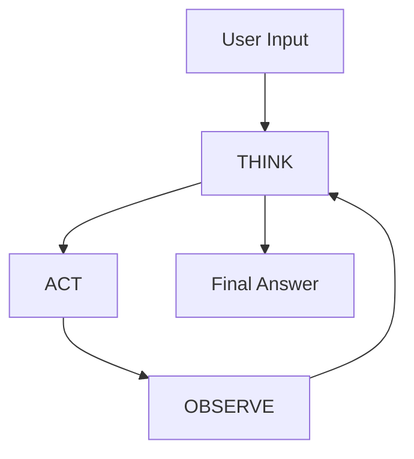
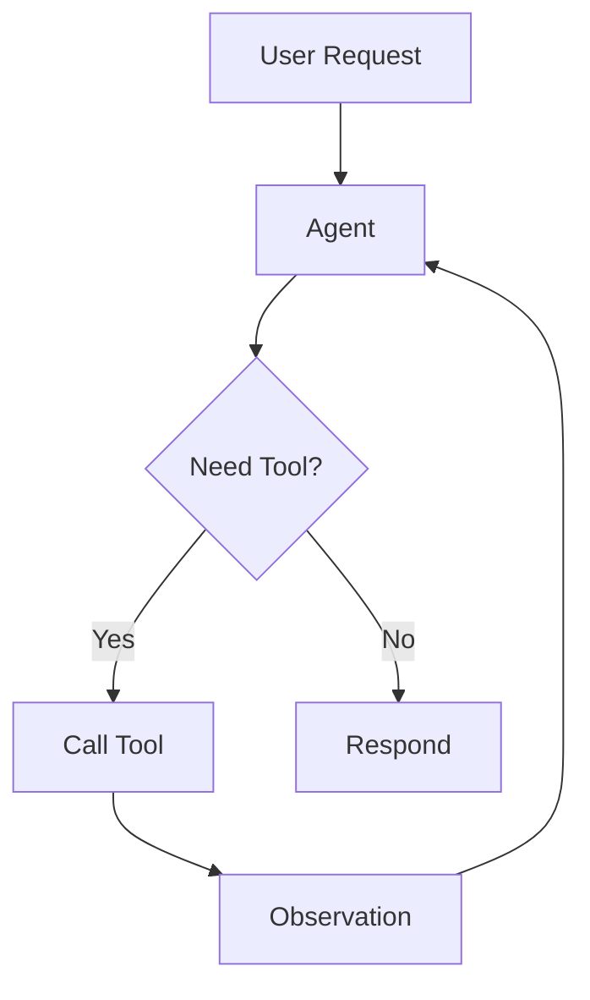
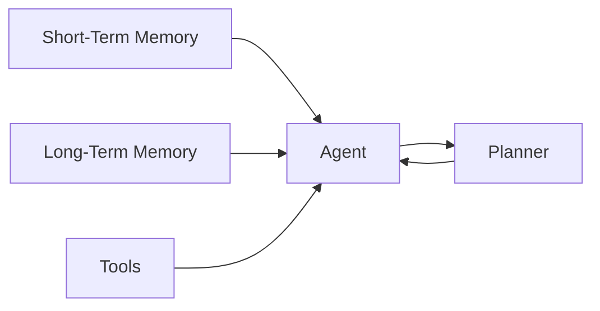
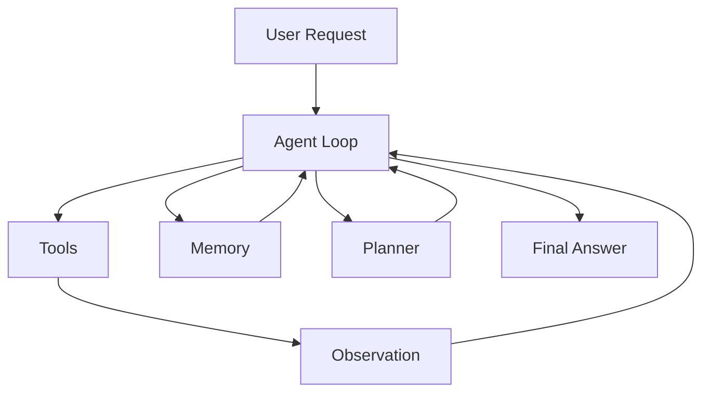

“AI agent” has become one of those terms that sounds impressive but often hides more than it explains.

A chatbot is called an agent.  
A prompt chain is called an agent.  
A tool-calling system is called an agent.  

And somewhere in all of that, the definition becomes blurry.

So instead of adding another abstract definition, let’s do something simpler:

Let’s break the idea down into the smallest working pieces.

---

## The Core Idea

At its core, an AI agent is not magic.

It is a loop.

> THINK → ACT → OBSERVE → REPEAT



This loop is the difference between:

- A **static system** (input → output)
- A **dynamic system** (input → reasoning → action → feedback → refinement)

Once you see this loop, most “agent systems” stop feeling mysterious.

---

## What Actually Changes with Agents

In traditional systems, developers control the flow:

```text
Step 1 → Step 2 → Step 3
```

With agents, the model starts influencing the flow.

Instead of:

> “First summarize, then extract, then generate”

The system becomes:

> “Given this situation, what should I do next?”

That shift is subtle — but it changes everything.

---

## A More Concrete Mental Model

Here’s a cleaner way to think about an agent:

> An agent is a decision-maker sitting in a loop.

It looks at:
- The current goal
- The available tools
- The current state of the world

And then decides:

> “What is the next best action?”

---

## Where Tools Come In

A model alone is limited to:
- Its training data
- The prompt you give it

That’s not enough for real systems.

Agents become useful when they can interact with tools.



Now the system can:
- Look up real-time data
- Query databases
- Perform actions
- Fetch context

The model is no longer guessing.

It is **interacting**.

---

## The Role of Observation (Most People Miss This)

Calling a tool is not the important part.

**Using the result correctly is.**

The observation step is where the system updates its understanding.

Bad agents:
- Ignore observations
- Misinterpret results
- Stop too early

Good agents:
- Adjust their reasoning after each step
- Decide whether more information is needed
- Know when to stop

That is what makes the loop powerful.

---

## Memory: Why Stateless Systems Feel Dumb

Without memory, every interaction is isolated.

That means:
- No context carryover
- No learning from past steps
- No personalization

With memory, things change.



Now the agent can:
- Remember previous steps
- Store useful insights
- Build continuity across actions

But memory introduces risk:
- Wrong memory can compound errors
- Old memory can mislead decisions

So memory must be curated — not blindly accumulated.

---

## Planning: The Difference Between Smart and Structured

Reactive agents can work step by step.

But larger tasks need structure.

Instead of:
> “What should I do next?”

Planning asks:
> “What are all the steps I need?”

Then executes them.

This prevents:
- Random exploration
- Missed steps
- Inefficient loops

But planning has its own failure mode:

> A beautiful plan that is completely wrong.

So planning works best when paired with:
- Validation
- Constraints
- Review

---

## Orchestration: The Hidden Layer

Most people think the model is the agent.

It’s not.

The real system includes:

- The model (decision-maker)
- The tools (capabilities)
- The memory (context)
- The orchestrator (controller)

The orchestrator:
- Executes tool calls
- Passes observations back
- Enforces limits
- Logs behavior
- Applies guardrails

Without orchestration, you don’t have a system.

You have a demo.

---

## Guardrails: Where Production Systems Survive or Fail

This is the part most demos skip.

Agents can:
- Call the wrong tool
- Loop forever
- Take unsafe actions
- Produce confident nonsense

So real systems need boundaries:

- Max number of steps
- Allowed tools
- Input validation
- Output checks
- Human approval for risky actions

The goal is not to restrict the model completely.

The goal is to make failure **visible and controllable**.

---

## Putting It All Together

When you combine everything, an agent system looks like this:



This is not one feature.

It is a system of interacting parts.

---

## The Key Insight

> Agents are not features. They are decision systems.

That means:
- They introduce flexibility
- They introduce uncertainty
- They require design

---

## The Real Takeaway

The mistake most teams make is this:

They start with the idea of an agent.

They should start with the problem.

Then ask:

- Do we need a loop?
- Do we need tools?
- Do we need memory?
- Do we need planning?

And only then decide:

> “Do we actually need an agent?”

Because sometimes the best agent…

…is no agent at all.
