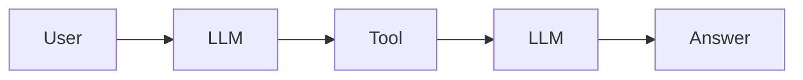
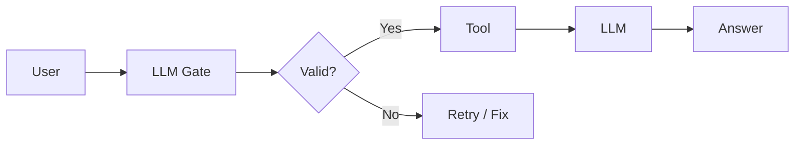
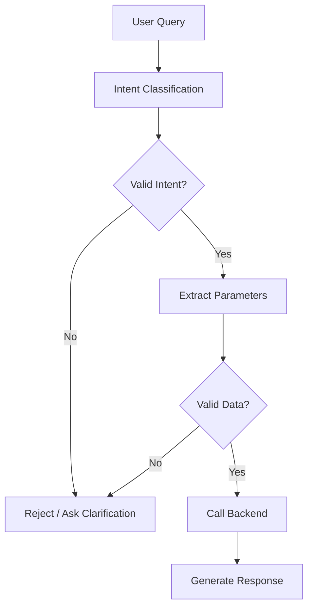
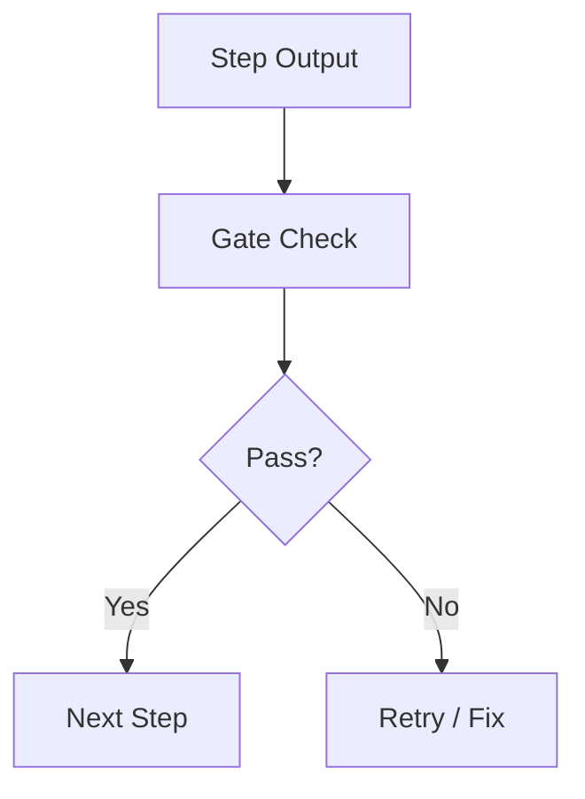

*Why your LLM workflow works in demos...and fails in real systems*

## The Moment You Realize Prompt Chaining Isn't Enough

Early on prompt chaining feels clean.

You take a problem, break it into steps, and let the LLM handle each step:

1. Understand intent
2. Fetch data
3. Generate response

It works beautifully in controlled examples.

But the first time you run it in production against messy, real user inputs, things start to break:

- The model says **it doesn't need data...** When it actually does
- It calls tools with the wrong parameters
- It confidently generates answers without checking all the facts

That's when you realize:
> Prompt chaining alone is not a system. It's a sequence of guesses.

What you are missing is control in between steps. That's where gate checks come in.

---

## What are Gate Checks?

A gate check is a decision point in the workflow that determines:

> Should the work flow proceed to the next step or redo the previous step?

It's a guardrail between individual steps. 

Instead of blindly chaining prompts:



> User --> LLM --> Tool --> LLM --> Answer

You introduce validation checkpoints:



> User --> LLM(Gate) --> Decision --> Tool --> LLM --> Answer

The key idea is to not let the model proceed with the workflow unless it has earned it (done the previous step correctly).

---

## A Simple example (Without Gate Checking)

Let's say the user asked:

> "What time is my flight tomorrow?"

A prompt chain may look like this:

```python
def handle_query(query):
	# Step 1: Ask LLM if we need calendar data  
	needs_calendar = llm(f"""  
	Will this query require calendar data?  
	Query: {query}  
	Answer Yes or No.  
	""")  
  
	if "Yes" in needs_calendar:  
		calendar_data = get_calendar("tomorrow")  
		return llm(f"Answer the question using this: {calendar_data}")  
  
	return llm(f"Answer the question: {query}")
```

### Looks fine… but here’s the problem:

- What if the model says **“No” by mistake?**
- What if it says **“Yes” but with wrong reasoning?**
- What if the answer format is inconsistent?

You’ve given the model **too much freedom, too early**.

---

## Introducing Gate Checks

Instead of trusting a free-form response, you force **structured decisions**.

### Gate Check #1: Intent Classification (Strict)

```python
def classify_intent(query):
	response = llm(f"""  
	Classify the query into one of:  
	- calendar  
	- weather  
	- general  
  
	Query: {query}  
  
	Return ONLY the label.  
	""")  
  
return response.strip().lower()

```

### Gate Check #2: Enforced Routing

```python
def handle_query(query):
    intent = classify_intent(query)

    if intent == "calendar":
        data = get_calendar("tomorrow")
        return llm(f"""
        You are answering a calendar query.
        Data: {data}
        Question: {query}
        """)

    elif intent == "weather":
        data = get_weather("tomorrow")
        return llm(f"""
        You are answering a weather query.
        Data: {data}
        Question: {query}
        """)

    elif intent == "general":
        return llm(f"Answer the question: {query}")

    else:
        raise ValueError("Invalid intent classification")
```

### What changed?

- The model **doesn’t decide everything at once**
- Each step has **clear boundaries**
- You can **log, test, and debug each gate**

This is the difference between:

> “The model seems to work”  
> vs  
> “I understand exactly why it works”

---

## Real-World Example: Customer Support Agent

Let’s move beyond hypothetical examples.

Imagine you’re building a support assistant.

User asks:

> “Why was I charged twice last week?”

Without gate checks, the system might:

- Jump straight to an answer
- Guess based on patterns
- Skip account lookup entirely

### With Gate Checks



#### Gate 1: Is account data required?

```python
requires_account = llm("""
Does this query require user account data?

Query: Why was I charged twice last week?

Answer YES or NO only.
""")
```

#### Gate 2: Extract parameters

```python
details = llm("""
Extract:
- time range
- issue type

Query: Why was I charged twice last week?

Return JSON.
""")
```

#### Gate 3: Validate extraction

```python
def validate_details(details):
    return "time range" in details and "issue type" in details
```

#### Gate 4: Only then call backend

```python
if requires_account == "YES" and validate_details(details):
    data = get_billing_data(details)
```
### Why this matters

You’re not just building a chatbot. You’re building a **decision system**.

A decision system needs:
- Verification
- Constraints
- Observability

Gate checks give you all three.

---
## The Subtle Power of “Say No”

One of the most underrated aspects of gate checks:

> They allow the system to **refuse to proceed**

Example:
```python

if intent not in ["calendar", "weather", "general"]:  
    return "I’m not confident enough to process this request."
    
```

That single line prevents:
- Hallucinated tool calls
- Wrong API usage
- Confident nonsense

In production systems, this is gold.

---
## Where People Go Wrong

This is where most implementations fall apart.
### 1. Treating LLM output as truth

If your system assumes:

> “If the model said it, it must be right”

You’re already in trouble. Gate checks should **challenge the model**, not trust it blindly.

---
### 2. Using free-form outputs instead of constrained ones

Bad:

> "Yeah, I think maybe this needs calendar data"

Good:

> calendar

Structure is everything.

---
### 3. Skipping validation between steps

Every step should answer:



> “Is this safe to move forward?”

If not, stop.

---
### 4. Over-chaining without control

More steps ≠ better system.

Without gates, more steps just means:

> More places to fail silently

---
## When to Use Gate Checks (and When Not To)

Use them when:
- You’re calling external tools (APIs, DBs)
- You need **correctness over creativity**
- The cost of being wrong is high
- You want debuggability

Avoid overusing them when:
- You’re generating pure content (blogs, summaries)
- The flow is simple and deterministic
- Latency matters more than precision

---
## The Bigger Picture

Prompt chaining was the first step. Agents (like ReAct) made the model smarter about decisions.

But even with agents, this still holds:

> You don’t scale AI systems by making the model smarter  
> You scale them by adding **structure around the model**

Gate checks are that structure.

They turn:

- “LLM as a clever assistant”  
    into
- “LLM as a reliable system component”

---
## In Conclusion

Don’t let the model move forward just because it _can_. Make it prove that it _should_.

That’s the difference between a demo… and something you can trust.