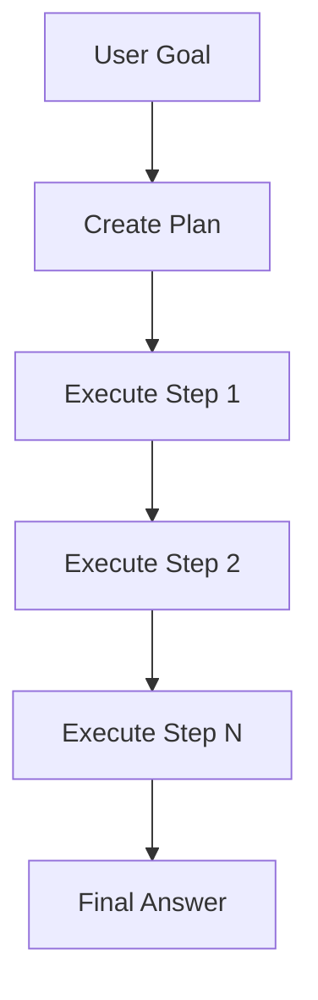
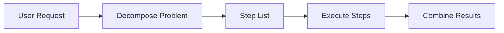
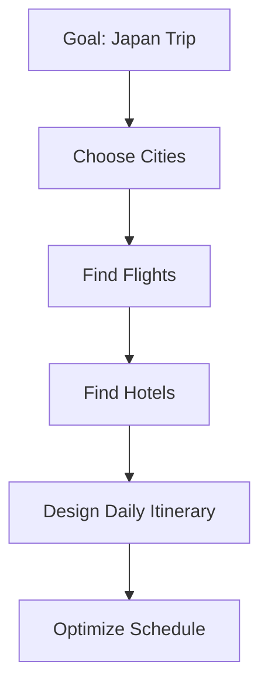
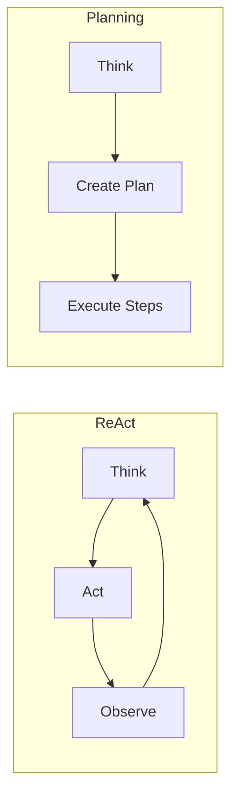
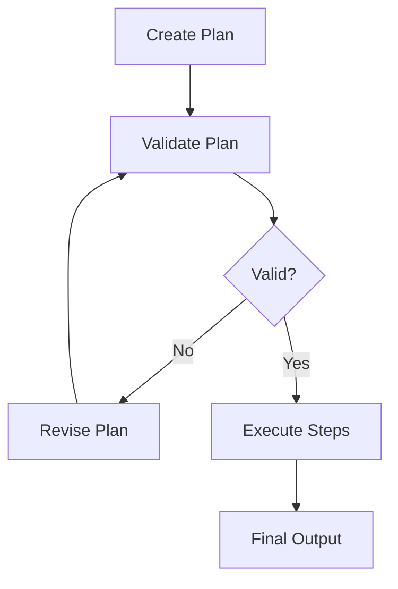
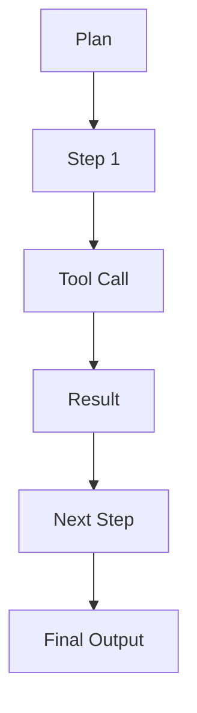

## Why Planning Matters

Most agent demos look impressive… until they don’t.

You give a goal, the agent starts acting, and then:
- It searches the wrong thing
- It skips important steps
- It loops inefficiently

The root issue is simple:

> Acting without structure leads to wandering.

Planning is what gives agents structure.

---

## The Core Idea

Planning is how an agent decides *what to do before doing it*.

Instead of:
> “What should I do next?”

It asks:
> “What are all the steps required to solve this?”



This is the difference between:
- Reactive behavior
- Structured execution

---

## Mental Model

A simple way to think about planning:

> Break the problem → Execute sequentially → Combine results



This is how humans approach complex tasks.

Agents are just doing the same thing programmatically.

---

## Concrete Example: Planning a Japan Trip

User asks:

> “Plan a 7-day Japan trip”

A non-planning agent might:
- Jump into random searches
- Generate a generic itinerary
- Miss constraints (budget, season, travel time)

A planning agent first creates structure:



Only after this does it start executing.

---

## Planning vs ReAct (Important Distinction)

ReAct agents:
- Think → Act → Observe → Repeat

Planning agents:
- Think → Build plan → Execute



👉 ReAct = iterative  
👉 Planning = structured

Good systems often use **both**.

---

## Where Planning Helps

Planning works best when:

- The task has multiple steps
- Order matters
- Missing a step is costly
- The goal is complex

Examples:
- Research reports
- Travel planning
- Launch readiness checks
- Incident analysis

---

## Where Planning Fails

Planning is not automatically correct.

Common failure mode:

> A clean, logical plan that is fundamentally wrong.

Example:

```text
1. Design launch page
2. Prepare marketing copy
3. Send announcement
```

Missing:
```text
Check if the product is actually live
```

That’s a system failure, not a model failure.

---

## Adding Guardrails to Planning

To make planning reliable, you need structure around it.



Key controls:
- Plan validation
- Required checklists
- Step limits
- Human review (for high-risk tasks)

---

## Planning + Tools

Planning becomes powerful when combined with tools.



Now each step is not just reasoning — it is **grounded in real data**.

---

## Key Insight

> Without planning, agents act randomly.  
> With planning, agents act predictably.

Planning doesn’t make agents smarter.

It makes them **more reliable**.

---

## Final Thought

The mistake is thinking:

> “Let the agent figure it out”

The better approach is:

> “Help the agent think before it acts”

Because in real systems, randomness isn’t intelligence.

Structure is.

---

## Next

--> [[memory-in-agents| Memory in AI Agents]]
