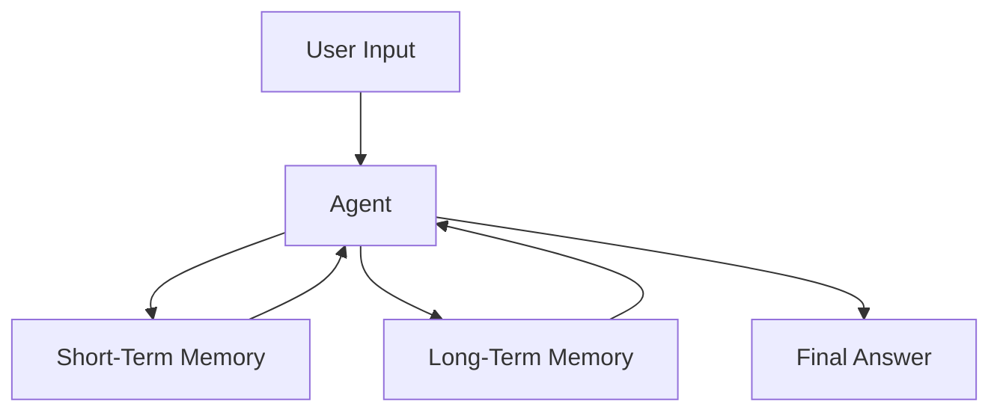
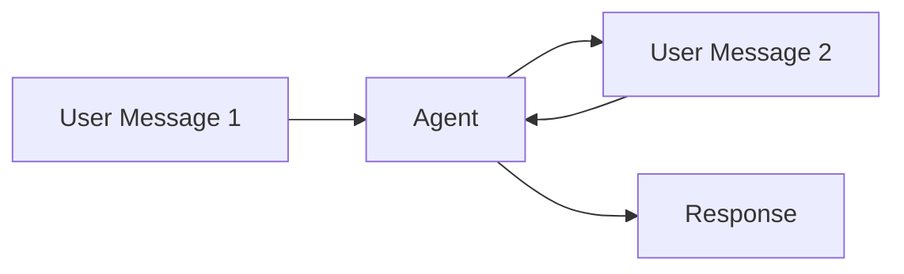
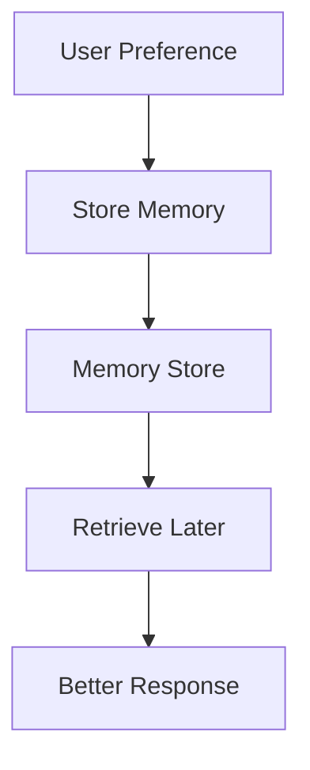
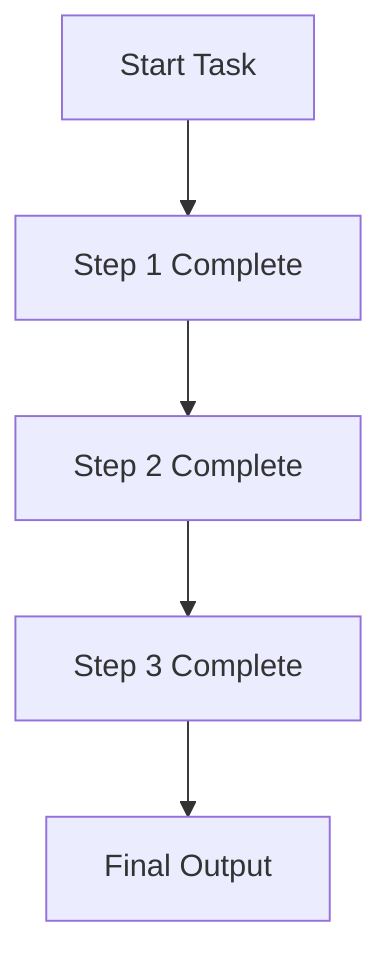
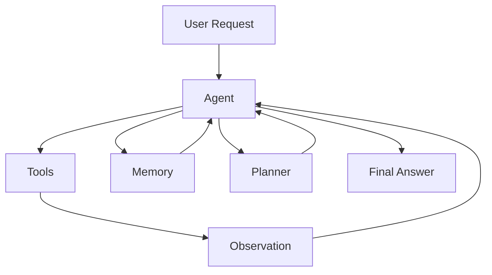
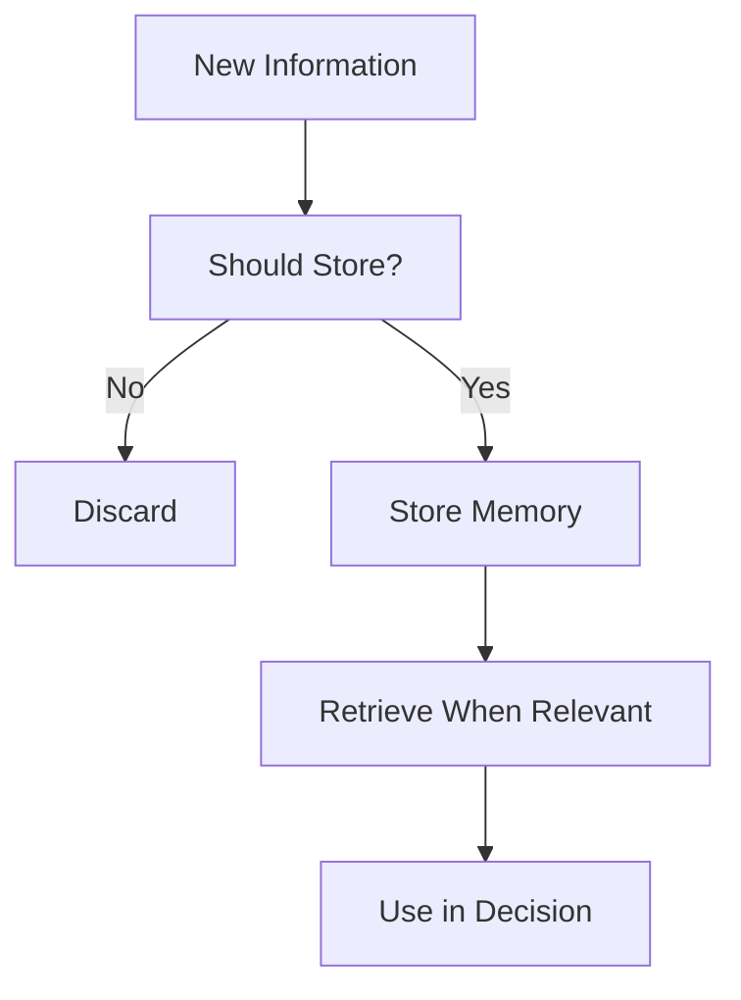

## Why Memory Matters

Most AI systems feel smart… until you use them twice.

You tell it something once.  
Then you have to tell it again.  
And again.

That’s not intelligence.

That’s stateless behavior.

> Memory is what turns an AI system from a tool into a collaborator.

---

## The Core Idea

Memory allows an agent to carry information across steps and interactions.

Without memory:
- Every step starts from scratch
- No continuity
- No personalization

With memory:
- Context builds over time
- Decisions improve
- Interactions feel connected

---

## The Mental Model

Think of memory as **context that persists beyond a single step**.

The agent is not just reacting to the current input.

It is reacting to:
- What just happened
- What has happened before

---

## Types of Memory

Not all memory is the same. Each type serves a different purpose.

### 1. Short-Term Memory (Conversation Memory)

This is the current interaction context.

It helps the agent:
- Maintain context within a session
- Understand follow-up questions
- Avoid repeating itself

---

### 2. Long-Term Memory (Persistent Memory)

This stores information across sessions.

Examples:
- Writing style preferences  
- Product requirements  
- User habits  

This is where personalization comes from.

---

### 3. State Memory (Task Progress)

This tracks what has already been done in a workflow.

Without this:
- Agents repeat work
- Lose track of progress
- Produce inconsistent results

---

## A Simple Example

User says:

> “I prefer vegetarian food”

Later:

> “Recommend a dinner recipe”

Without memory:
- Generic recipes

With memory:
- Vegetarian recipes

This seems simple.

But it’s the foundation of:
- Personal assistants  
- AI copilots  
- Long-running workflows  

---

## Memory in Real Agent Systems

In practice, memory interacts with everything.

Memory influences:
- What the agent does next
- How it interprets results
- What it prioritizes

---

## Where Memory Goes Wrong

Memory is powerful — but dangerous if unmanaged.

### 1. Bad Memory

If incorrect information is stored:
- Errors compound over time

---

### 2. Stale Memory

Old context may:
- Override current reality
- Lead to wrong decisions

---

### 3. Too Much Memory

More memory ≠ better system

Too much memory leads to:
- Noise
- Slower reasoning
- Confusion

---

## Designing Memory Properly

Good memory systems answer:

- What should be remembered?
- What should be forgotten?
- When should memory expire?
- What memory is relevant *right now*?

Memory is not storage.

It is **curation**.

---

## Key Insight

> Memory is not about storing more.  
> It is about retrieving what matters.

That’s what creates relevance over time.

---

## Final Thought

Without memory:
- Agents feel stateless  
- Responses feel generic  

With memory:
- Systems feel adaptive  
- Decisions feel informed  

But only if memory is designed carefully.

Because in agent systems:

> What you remember matters just as much as what you decide.

---

## Next

--> [[reliable-agents| Building Reliable Agent Workflows]]
