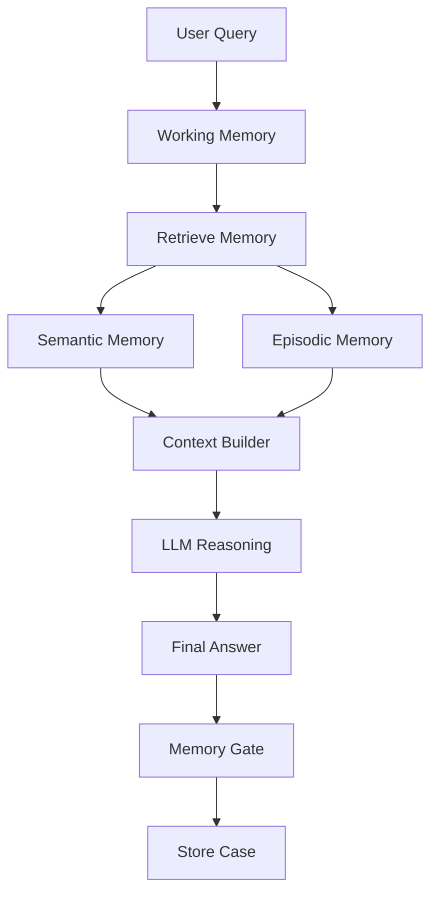

## Part 4 of the *AI Systems Thinking* Series

---

## The System Worked. But Something Felt Off.

We had built something powerful.

An agent that could answer vendor questions like:

> “Why did I not receive orders this week?”

It wasn’t trivial.  
The system pulled data across 10+ internal pipelines:
- Demand forecasts  
- Vendor fill rates  
- PO acknowledgements  
- Substitution logic  
- Allocation rules  

It stitched everything together and produced a reasoned answer.

And it worked.

But after running it for a while, a pattern emerged.

---

## The Same Question Kept Costing Us the Same Effort

Different vendor.  
Same problem.

Different week.  
Same root cause.

And yet…

The system behaved like it had never seen the problem before.

Every query triggered:
- Fresh retrieval  
- Fresh reasoning  
- Fresh analysis  

It didn’t matter if we had already solved the exact same issue yesterday.

> The agent solved problems… but it never got better at solving them.

That’s when it became clear:

**We hadn’t built intelligence.  
We had built a stateless system.**

---

## What “Stateless” Actually Means

Most AI systems today—even advanced ones—are stateless.

What does that really mean?

It means:

- Every request is treated as new  
- No reuse of prior investigations  
- No accumulation of experience  
- No improvement over time  

In practice:

> The same vendor issue required the same 30–60 minute investigation every single time.

---

## The Misconception: Memory = Chat History

When people talk about “memory” in AI systems, they usually mean one of two things:

- Chat history  
- Vector database (RAG)

Both are useful.

Neither is enough.

---

## What Memory Actually Means in an Agent

### 1. Working Memory
- Current query  
- Tool outputs  
- Intermediate reasoning  

### 2. Semantic Memory
- Policies  
- Documentation  
- Rules  

### 3. Episodic Memory
- Previous investigations  
- Root causes  
- Patterns  

### 4. Procedural Memory
- How to solve problems  

---

## The Missing Piece in Our System

We had:
- Retrieval (RAG)
- Reasoning (LLM)
- Planning
- Gate checks

But not memory.

---

## Architecture



---

## Before vs After

### Before
- Repeated investigations  
- High latency  
- No learning  

### After
- Faster hypotheses  
- Reuse of past cases  
- Reduced investigation time  

---

## Memory Is Dangerous

- Wrong conclusions persist  
- Overfitting to past  
- Data leakage risks  

---

## Memory Gates

```python
def should_store(case):
    return (
        case["confidence"] > 0.8 and
        case["root_cause"] is not None
    )
```

---

## Minimal Example

```python
def agent(query):
    semantic = retrieve_semantic(query)
    episodic = retrieve_cases(query)

    context = build_context(semantic, episodic)

    answer = llm(query, context)

    if should_store(answer):
        store_case(answer)

    return answer
```

---

## Key Insight

**Memory turns an LLM into a system.**

---

## Series Connection

- Part 1: RAG  
- Part 2: Gate Checks  
- Part 3: Planning  
- Part 4: Memory  

---

## Final Thought

Without memory:

> Fast system with amnesia

With memory:

> System that improves over time

---

## Next

--> [[part5-learning-agents|Learning Agents - Why Memory Alone Isn’t Enough]]
