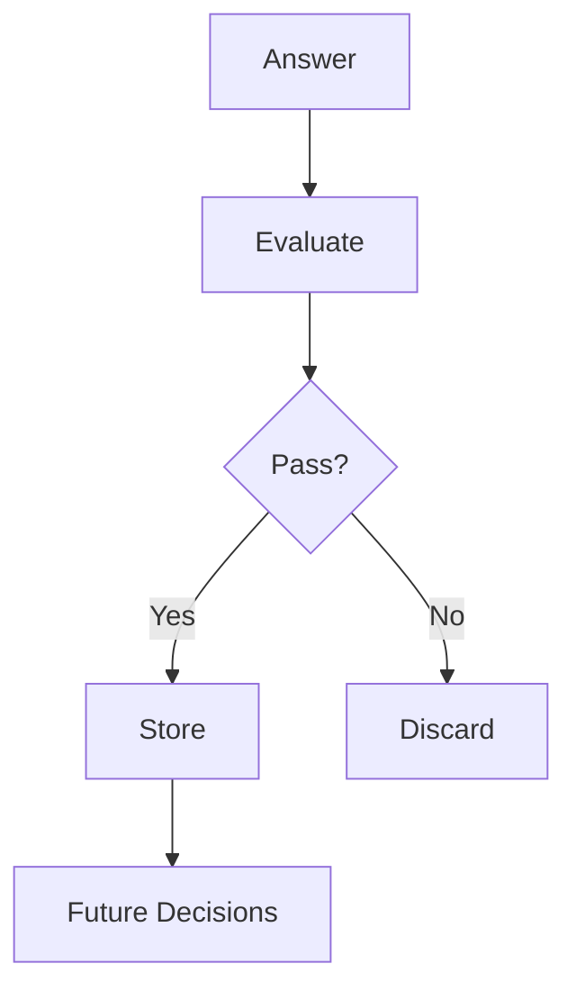

## Part 5 of the *AI Systems Thinking* Series

---

## We Added Memory. The System Got Faster.  
But We Still Had a Problem.

In Part 4, we introduced memory into our agent.

The results were immediate:
- Faster investigations  
- Reuse of past cases  
- Better initial hypotheses  

But a critical question remained:

> What if the system is remembering the wrong things?

---

## The Dangerous Illusion of Learning

More memory ≠ better system.

Real learning means:

> Changing behavior based on validated outcomes.

Without validation:
- Wrong conclusions persist  
- Bias compounds  
- Confidence increases incorrectly  

---

## What Was Missing: Evaluation

Memory gave continuity.

Evaluation gives **control**.

We needed a way to answer:

> Should this be remembered?

---

## What Evaluation Means

Evaluation answers:

- Was the reasoning correct?
- Was it grounded in real evidence?
- Did the outcome validate the explanation?

---

## Types of Evaluation

### Outcome Evaluation
Did reality confirm the answer?

### Evidence Evaluation
Was the reasoning based on real signals?

### Consistency Evaluation
Same input → same reasoning?

### Human-in-the-Loop
Real users validate correctness.

---

## Closing the Loop

Without evaluation:

Answer → Store

With evaluation:

Answer → Evaluate → Store (or Reject)

---

## Architecture



---

## Minimal Code

```python
def evaluate(answer):
    return score(answer) > 0.8

def agent(query):
    answer = llm(query)
    if evaluate(answer):
        store(answer)
    return answer
```

---

## Key Insight

Memory gives continuity.  
Evaluation gives direction.

---

## Series Connection

- Part 1: RAG  
- Part 2: Gate Checks  
- Part 3: Planning  
- Part 4: Memory  
- Part 5: Evaluation  

---

## Final Thought

Without evaluation:

> Systems remember the wrong things.

With evaluation:

> Systems start to learn.
