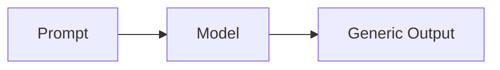
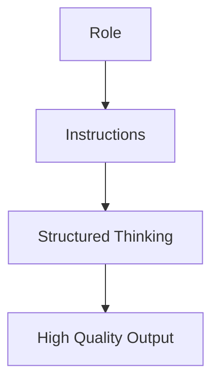
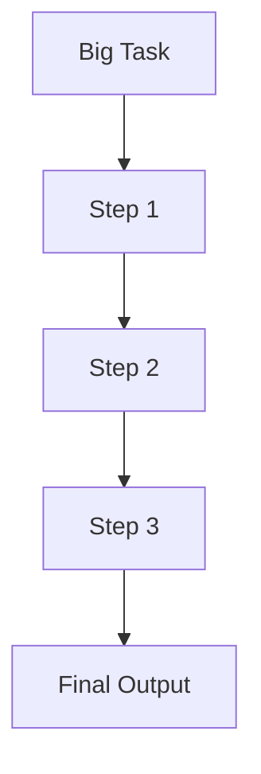
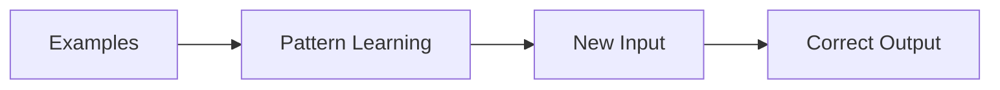
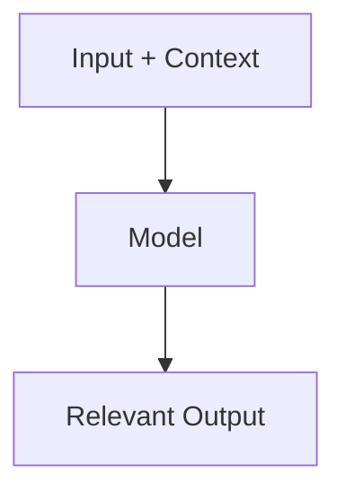
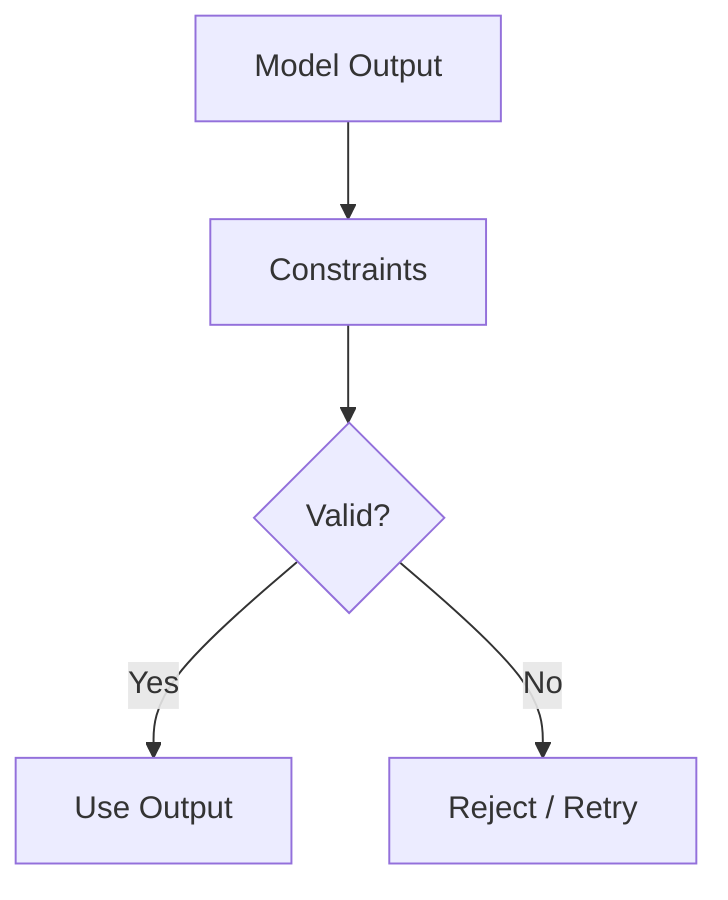
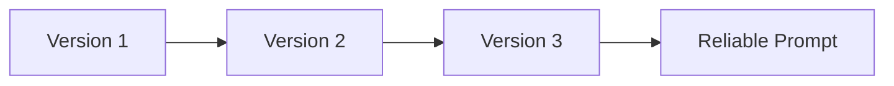
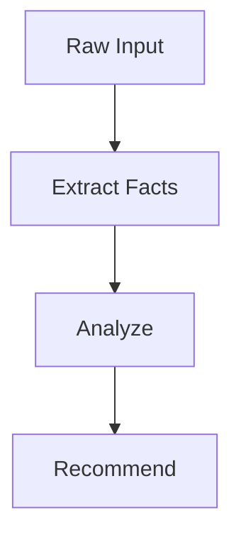

*And why most advice online misses the point*

---

## The Moment Prompt Engineering Clicks

Most people start prompt engineering like this:

“Explain gradient descent.”

And sometimes, that works. But often, the response feels generic. Flat. Forgettable.



That’s when people start tweaking wording. Adding adjectives. Rephrasing questions.

But the real shift happens when you realize this:

**You are not asking questions. You are designing behavior.**

Once you see that, everything changes.

Instead of asking:
“Explain overfitting”

You start designing:
“Explain overfitting like a teacher would, using an analogy, then a simple example, then a reason why it happens.”

That’s not a better question. That’s a controlled system.

---

## Technique 1: Role Prompting — Give the Model a Personality

Think about how you’d ask two different people the same question:
- A professor
- A junior engineer

You expect very different answers.

LLMs behave the same way. If you don’t define a role, you get a generic voice.

Here’s the difference in practice:

### Weak Prompt
Explain overfitting.

### Strong Prompt
You are a machine learning professor.

Explain overfitting to a beginner:
- Start with an analogy
- Then give a simple example
- Then explain why it happens

What you’re doing here is subtle but powerful:
You’re shaping *how the model thinks*, not just what it says.



---

## Technique 2: Breaking Down Thinking (Instruction Decomposition)

One of the biggest mistakes people make is asking for too much in one go.

“Analyze this dataset and give insights” sounds reasonable—but it’s vague.

Instead, guide the thinking process:

Step 1: Identify key variables  
Step 2: Describe distributions  
Step 3: Identify correlations  
Step 4: Suggest 3 actionable insights  

Now the model isn’t guessing what you want—it’s following a path.



This is especially useful in real-world workflows.

### Real Example

Imagine you’re analyzing product metrics.

Instead of:
“Tell me what’s wrong with my product”

You write:
- Step 1: Identify drop-offs in funnel  
- Step 2: Compare week-over-week trends  
- Step 3: Highlight anomalies  
- Step 4: Suggest root causes  

Now the output becomes something you can actually use.

---

## Technique 3: Teaching Through Examples (Few-Shot Prompting)

Sometimes explaining what you want is harder than showing it.

LLMs are extremely good at pattern recognition.

### Example

Convert sentences into concise summaries:

Input: The model performed poorly due to high variance.  
Output: High variance caused poor performance.  

Input: The dataset contains many missing values.  
Output: Dataset has many missing values.  

Now:
Input: The training process was unstable due to learning rate issues.  
Output:

Instead of instructions, you’ve given a pattern.

And patterns are easier for the model to follow than abstract rules.



---

## Technique 4: Controlling the Output Format

This one sounds boring, but it’s one of the most important techniques if you’re building anything real.

If you don’t specify format, you get inconsistency.

### Example

Instead of:
“Give me a study plan”

Try:
Create a 7-day study plan in this format:

Day X:
- Topic
- Task
- Outcome

Now your output is predictable. And predictability is what lets you automate.

---

## Technique 5: Context is Everything

LLMs don’t “remember” unless you give them context.

This is where most people underperform—they assume the model knows their situation.

### Example

Context:
You are helping a Senior Product Manager with 10+ years of experience preparing for AI roles.

Task:
Suggest 3 ML projects that demonstrate system design thinking.

Same question, completely different quality.



---

## Technique 6: Guardrails — Preventing Confident Nonsense

LLMs will happily make things up if you let them.

So you need to constrain them.

### Example

If you are unsure, say "I don't know."  
Do not fabricate information.  
Only use known machine learning concepts.  

This won’t eliminate hallucination—but it reduces risk significantly.



---

## Technique 7: Iteration (This is Where Skill Actually Comes From)

No one writes perfect prompts on the first try.

The real skill is in refining.

Here’s what it looks like in practice:

- Version 1: Too vague  
- Version 2: Better structure, still noisy  
- Version 3: Clean, constrained, reliable  

You’re basically debugging behavior.



---

## Technique 8: Prompt Chaining — Thinking in Systems

Instead of one big prompt, break the task into steps.

### Example Pipeline

1. Extract key facts  
2. Analyze facts  
3. Generate recommendation  

This is how real AI systems are built.



---

## Code Example: OpenAI Prompt Chaining

```python
from openai import OpenAI
client = OpenAI()

def extract_facts(text):
    response = client.chat.completions.create(
        model="gpt-4o-mini",
        messages=[{"role": "user", "content": f"Extract key facts:\n{text}"}]
    )
    return response.choices[0].message.content

def analyze_facts(facts):
    response = client.chat.completions.create(
        model="gpt-4o-mini",
        messages=[{"role": "user", "content": f"Analyze these facts:\n{facts}"}]
    )
    return response.choices[0].message.content

def recommend(actions):
    response = client.chat.completions.create(
        model="gpt-4o-mini",
        messages=[{"role": "user", "content": f"Suggest actions:\n{actions}"}]
    )
    return response.choices[0].message.content
```

---

## Code Example: LangChain Structured Prompt

```python
from langchain.prompts import PromptTemplate
from langchain.chat_models import ChatOpenAI

llm = ChatOpenAI(model="gpt-4o-mini")

template = """
You are a product strategist.

Analyze the following metrics:
{data}

Return:
1. Key issue
2. Root cause
3. Recommendation
"""

prompt = PromptTemplate(input_variables=["data"], template=template)

response = llm.predict(prompt.format(data="Drop in conversion rate"))
print(response)
```

---

## The Bigger Picture

Most people treat prompt engineering like a set of tricks.

But it’s closer to:
- writing specifications
- designing workflows
- structuring thinking

The best prompt engineers aren’t clever writers.

They are clear thinkers.

---

## Closing Thought

If you want to improve fast:

Take one real problem you care about.

Break it into steps.

Design prompts for each step.

Refine until the output is reliable.

That’s how you go from:
“using AI”

to

“building with AI”

---

## Next

--> [[from-prompts-to-agents| From Prompts to Agents]]
