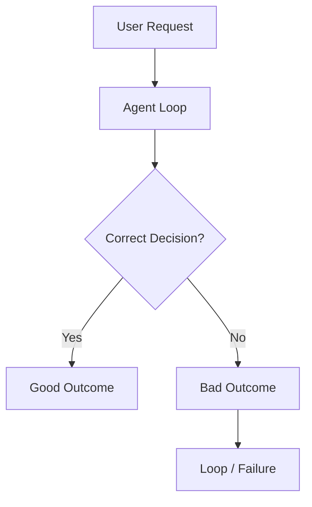
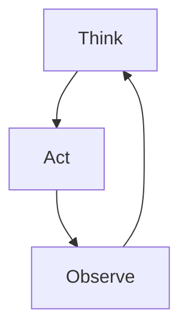
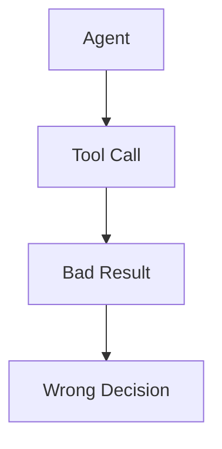
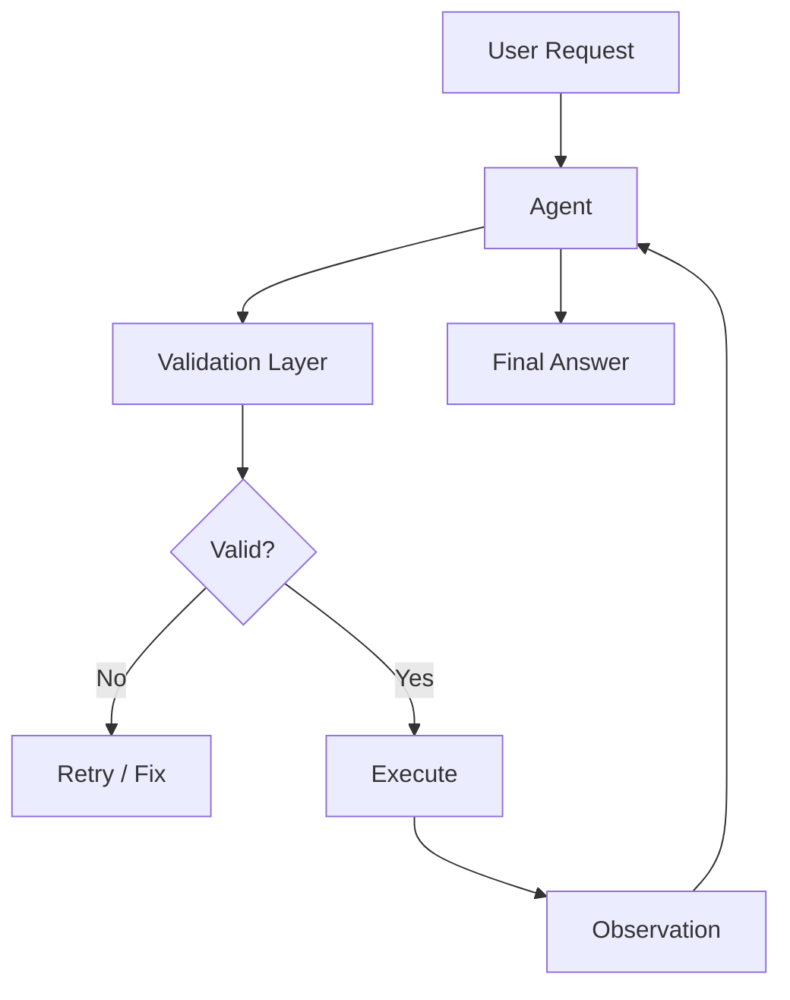
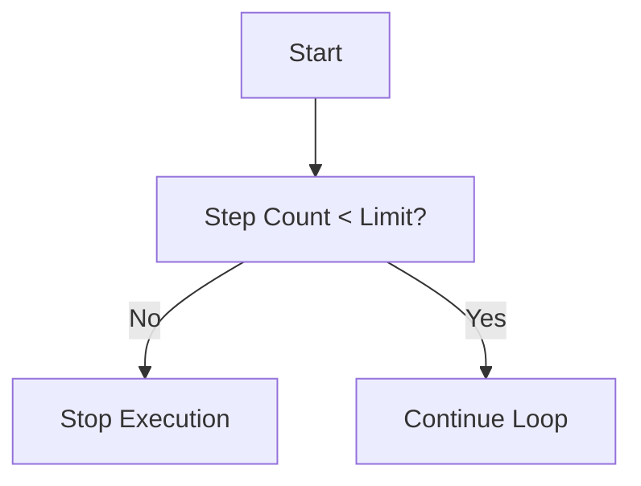
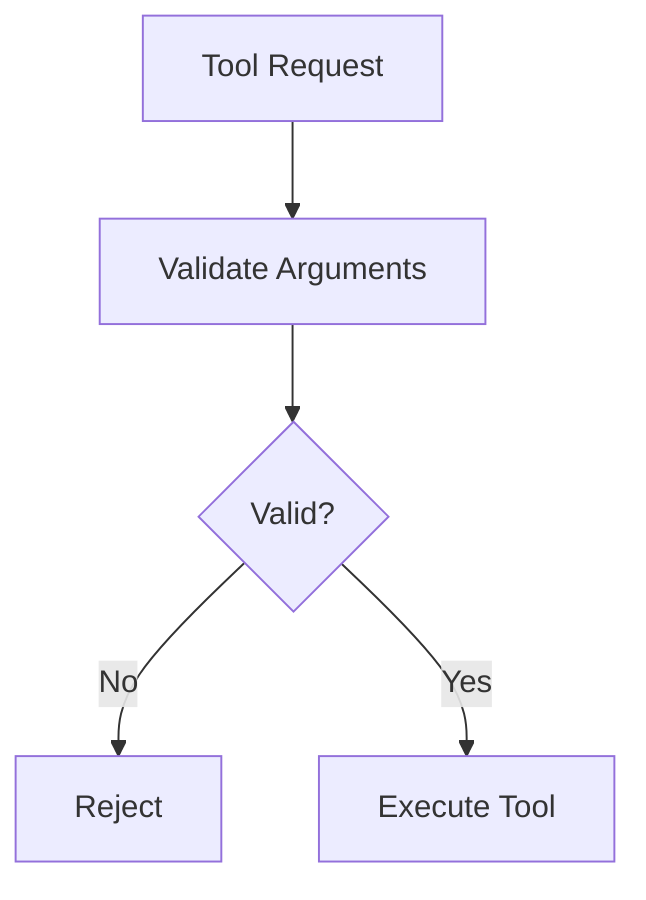
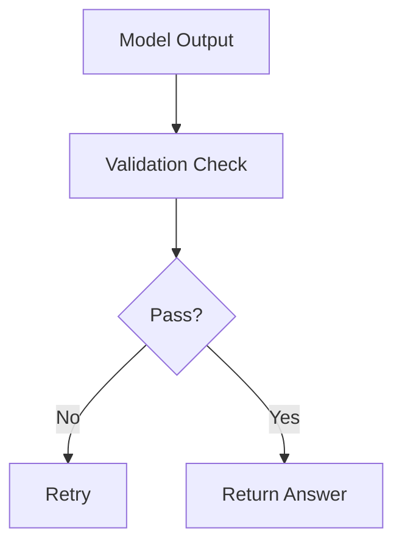
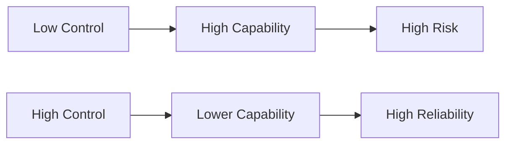

## Why Reliability Matters

Agent demos look impressive.

Until they don’t.

- The agent loops forever  
- Calls the wrong tool  
- Returns confident nonsense  

At that point, capability doesn’t matter.

> Reliability is what determines whether an agent is usable.

---

## The Core Problem

Agents are inherently:

- Probabilistic  
- Open-ended  
- Capable of making decisions  

That combination is powerful — but fragile.

Small errors compound quickly.

---

## Failure Modes You Will See

### 1. Infinite Loops

The agent keeps thinking:

> “I need more information”

And never stops.

Without a stopping condition, this loop never ends.

---

### 2. Bad Tool Outputs

Even if your agent is correct, tools can fail.

- API errors  
- Missing data  
- Incorrect results  

Garbage in → garbage out.

---

### 3. Hallucinations

The agent fills gaps with confidence.

- Invents facts  
- Misinterprets data  
- Skips validation  

This is especially dangerous when:
- Output looks correct
- But is subtly wrong

---

## The Shift You Need to Make

Most people try to make agents smarter.

That’s the wrong goal.

> Make them safer.

---

## Control Layer (This Is the Real System)

Reliable agents are not just loops.

They are **loops with control points**.

This is what turns:
- A demo → a system  
- A toy → a product  

---

## Practical Guardrails

### 1. Step Limits

Stop infinite loops.

---

### 2. Input Validation

Don’t trust tool inputs blindly.

---

### 3. Output Validation

Check before returning results.

---

### 4. Fallback Strategies

When things fail, don’t crash.

- Retry  
- Simplify task  
- Ask user for clarification  

---

## Reliability vs Capability

Here’s the tradeoff most teams get wrong:

- More autonomy → more risk  
- More control → more reliability  

The goal is not maximum capability.

The goal is:

> Controlled capability.

---

## Key Insight

> Reliability matters more than capability.

Because:

- Users trust consistent systems  
- Businesses depend on predictable behavior  
- Failures are expensive  

---

## Final Thought

If your agent is unreliable:

It doesn’t matter how powerful it is.

Because no one will use it twice.

---

## What Good Looks Like

A good agent system:

- Stops when it should  
- Validates before acting  
- Recovers from errors  
- Produces consistent output  

That’s not intelligence.

That’s engineering.

---

## Next

--> [[when-not-to-use-agents| When Not to Use Agents]]
