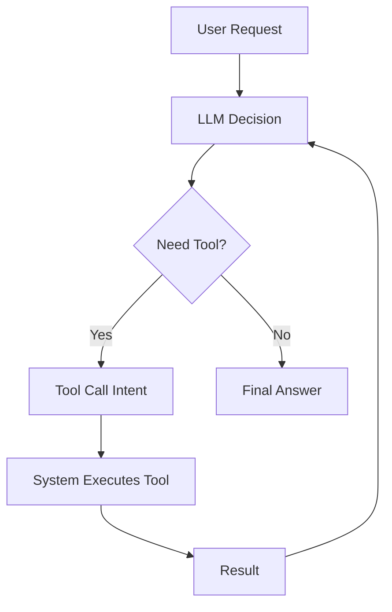
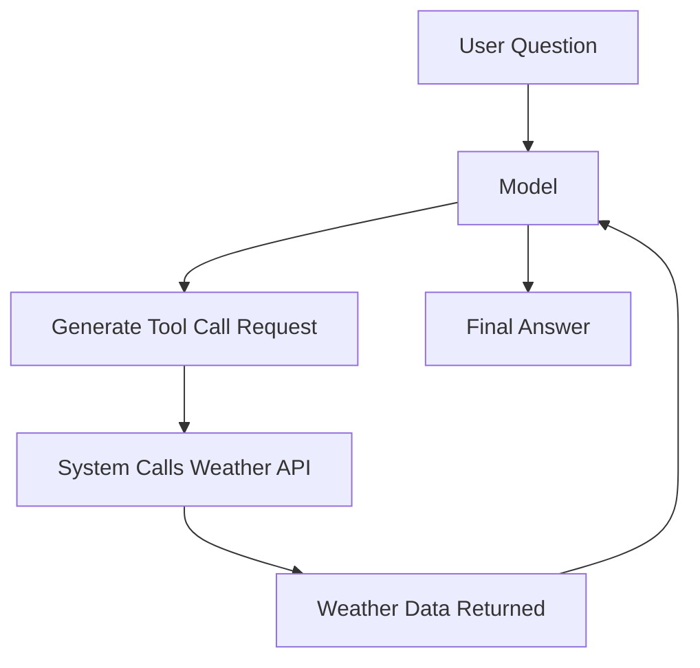
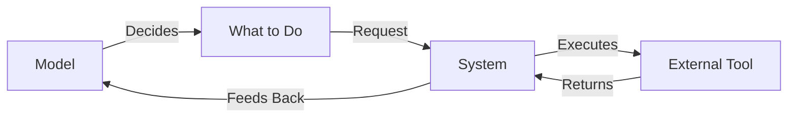
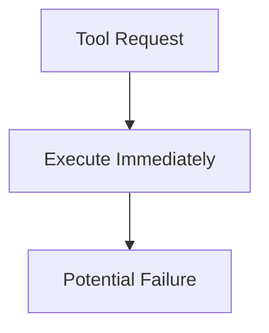
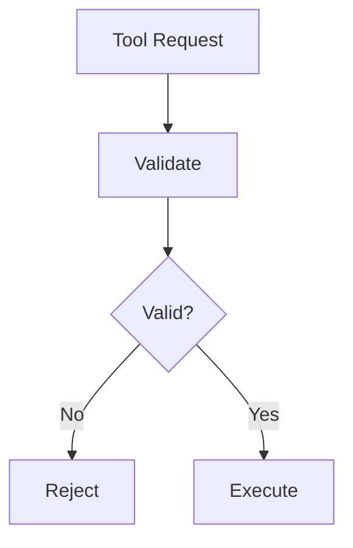
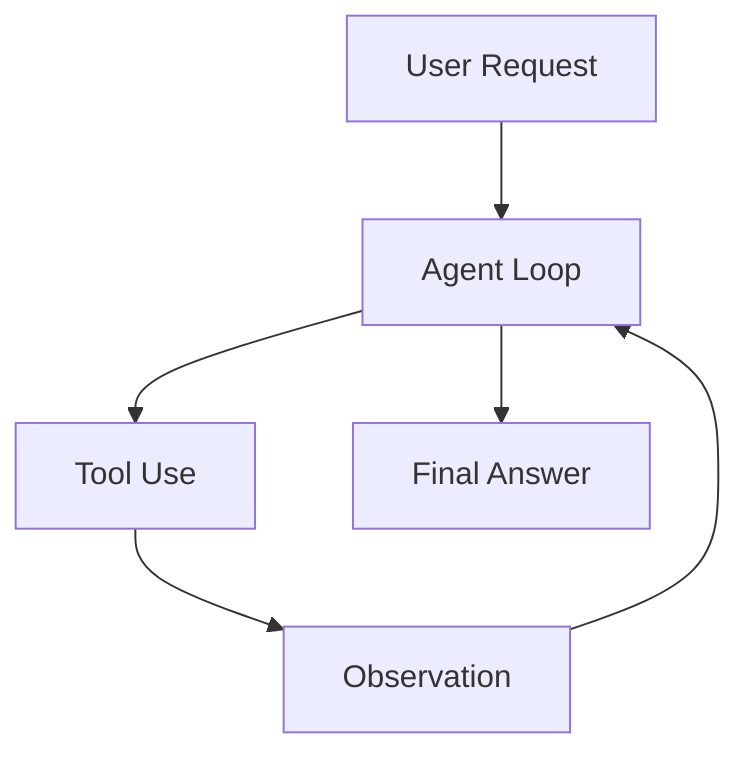

## Why Tools Matter

A language model on its own is limited.

It can:
- Generate text  
- Reason within context  
- Recall patterns  

But it cannot:
- Fetch real-time data  
- Query databases  
- Take actions in the world  

That’s where tools come in.

> Tools turn a model from something that *knows* into something that *can do*.

---

## The Core Idea

Tool calling is simple:

1. The model decides it needs external help  
2. It expresses that intent  
3. Your system executes the tool  
4. The result comes back  
5. The model continues  



This is not execution by the model.

This is coordination between:
- The model (decision)
- Your system (execution)

---

## Simple Example

User asks:

> “What’s the weather today?”

Here’s what actually happens:



Without tools:
- The model guesses

With tools:
- The model retrieves

---

## Mental Model

Think of tool calling like this:

> The model is a **decision engine**  
> Your system is an **execution engine**



Mixing these responsibilities is where systems break.

---

## Types of Tools

In practice, tools fall into a few categories:

### 1. Data Retrieval
- APIs (weather, finance, etc.)
- Databases
- Search systems

### 2. Computation
- Calculators
- Statistical models
- Transformations

### 3. Actions
- Sending emails
- Updating records
- Triggering workflows

Each type increases what your agent can do.

---

## Why Tool Design Matters

Bad tool:

```text
process_data(data)
```

Good tool:

```text
get_top_anomalies(data, count=3)
```

Clear tools:
- Reduce ambiguity  
- Improve model decisions  
- Increase reliability  

---

## Where Things Go Wrong

### 1. Blind Execution

If you execute everything the model asks:

- You risk bad inputs  
- You risk unsafe actions  



---

### 2. No Validation

Without validation:

- Wrong parameters pass through  
- Errors propagate  



---

### 3. Weak Feedback Loop

If results are unclear:

- The model misinterprets them  
- Decisions degrade  

---

## Tool Calling in Agent Systems

Tool calling is rarely standalone.

It sits inside a loop:



This is what enables:
- Multi-step reasoning  
- Real-world interaction  
- Iterative refinement  

---

## Key Insight

> Without tools, agents are just chatbots.  
> With tools, they become systems.

---

## Final Thought

Tool calling is not about giving models power.

It’s about giving them **controlled access to capabilities**.

Because in real systems:

> The goal is not maximum power.  
> The goal is **safe, reliable action**.
