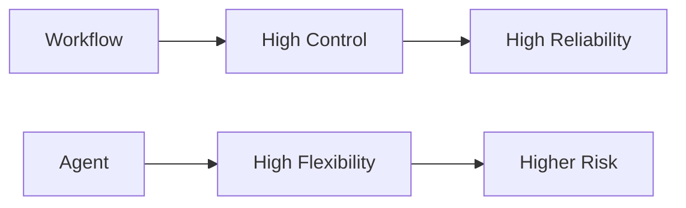
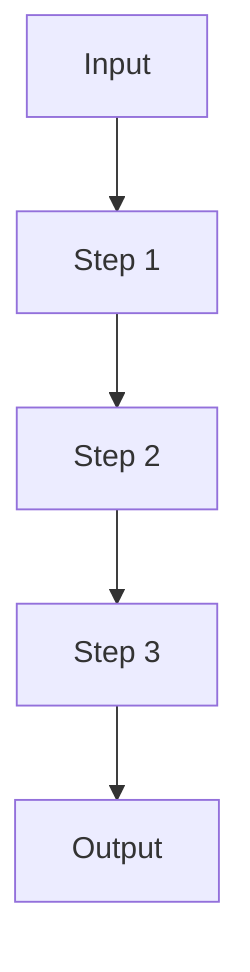
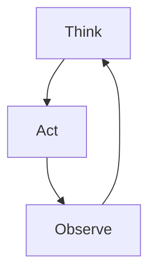
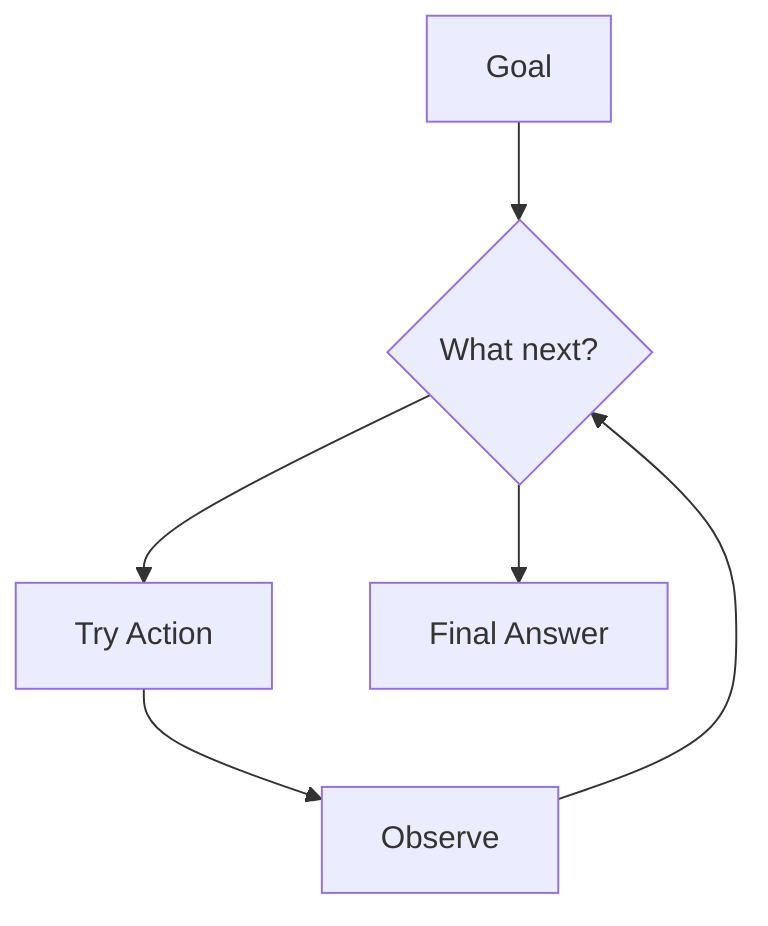
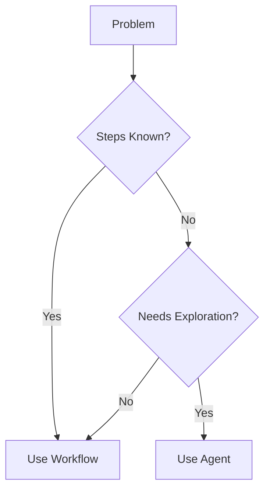

## Why This Matters

Agents are everywhere right now.

And that’s the problem.

People are reaching for agents before they understand the tradeoffs.

> Not every problem needs an agent.

In fact, most don’t.

---

## The Default Mistake

The typical thinking goes:

- Agents are powerful  
- My problem is complex  
- Therefore, I should use an agent  

That sounds reasonable.

But it often leads to:
- Unnecessary complexity  
- Higher latency  
- Lower reliability  

---

## The Core Tradeoff

Agents introduce:

- Flexibility  
- Autonomy  
- Decision-making  

But they also introduce:

- Uncertainty  
- Cost  
- Debugging difficulty  

---

## When You Should NOT Use Agents

### 1. When Steps Are Predictable

If you already know the steps, use a workflow.

Examples:
- Data pipelines  
- ETL jobs  
- Report generation  

There is no benefit in letting the model “decide” here.

---

### 2. When Latency Matters

Agents loop.

Loops take time.

If your system needs:
- Fast responses  
- Real-time interaction  

Agents may slow you down.

---

### 3. When Reliability Is Critical

Agents can:
- Loop incorrectly  
- Call wrong tools  
- Misinterpret results  

If failure is expensive:

- Payments  
- Medical workflows  
- Critical infra  

Use controlled workflows.

---

## When You SHOULD Use Agents

Agents shine when the path is unclear.

### 1. Unknown Problem Space

If you don’t know the steps ahead of time:

Examples:
- Research tasks  
- Open-ended analysis  
- Exploratory workflows  

---

### 2. Multiple Tools Required

When solving requires:

- APIs  
- Databases  
- Calculations  
- Search  

Agents can orchestrate these dynamically.

---

### 3. Iterative Refinement

If the task requires:

- Trying  
- Evaluating  
- Improving  

Agents can loop until quality improves.

---

## The Decision Framework

Instead of asking:

> “Can I use an agent?”

Ask:

> “Do I need one?”

---

## Key Insight

> Agents are not upgrades.  
> They are tradeoffs.

---

## Final Thought

The best systems are not the most sophisticated.

They are the most appropriate.

Because in real-world engineering:

> Simpler systems win more often than smarter ones.
