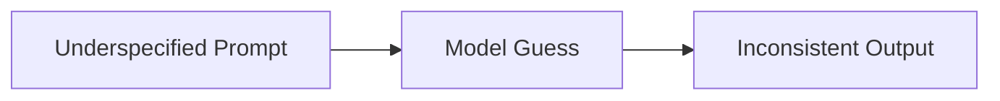
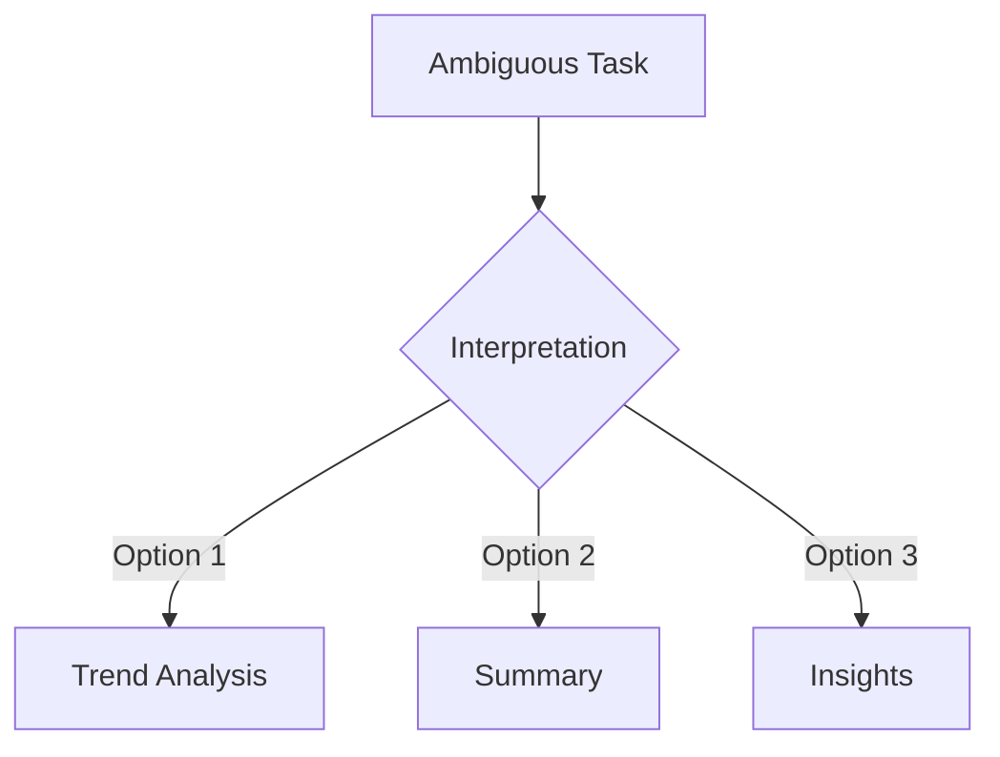
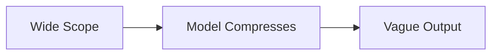
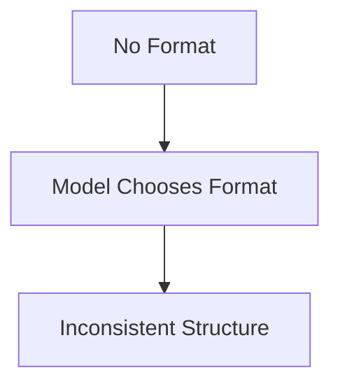
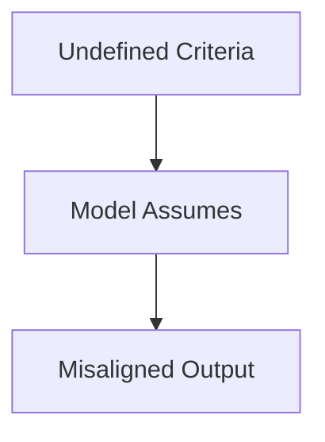
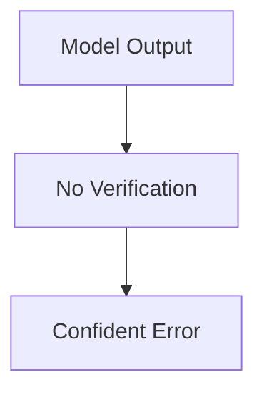
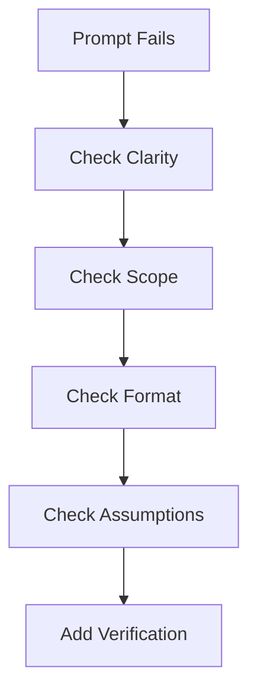

Most people think prompt engineering is about writing better prompts.

It’s not.

It’s about **debugging failure**.

Because if you use LLMs seriously—whether for learning, building, or product work—you’ll hit this wall:

> “Why is the model giving me bad or inconsistent answers?”

And the honest answer most of the time is:

> Your prompt is under-specified.

---

## The Reality: Prompts Fail More Than They Work

Early on, you’ll write something that works once.

Then you try again—and it breaks.

Different tone. Different structure. Missing details.

It feels random.

It’s not.

It’s just that your prompt is leaving too many decisions to the model.

---

## Failure Mode #1: Ambiguity

Example:

> Analyze this dataset

What does “analyze” mean?

- Summary?
- Trends?
- Anomalies?
- Business insights?

The model guesses.

And different guesses → different outputs.

---

### Fix: Make Decisions Explicit

Instead:

> Analyze this dataset and:
> - Identify 3 key trends  
> - Highlight 2 anomalies  
> - Suggest 2 business actions  

Now the model is not guessing.

You are deciding.

---

## Failure Mode #2: Scope Explosion

Example:

> Explain AI

That’s not a prompt. That’s a universe.

The model compresses everything into a vague average.

---

### Fix: Shrink the Scope

> Explain transformers to a beginner using a simple analogy in under 200 words.

Now:
- Clear topic
- Clear audience
- Clear constraint

---

## Failure Mode #3: Format Drift

You ask:

> Give me insights

You get:
- paragraphs
- bullets
- random structure

Next time? Different again.

---

### Fix: Force Structure

> Provide:
> - 3 bullet point insights  
> - 1 risk  
> - 1 recommendation  

Structure removes variability.

---

## Failure Mode #4: Hidden Assumptions

Example:

> Is this a good strategy?

What does “good” mean?

- High return?
- Low risk?
- Short-term?
- Long-term?

The model fills in the blanks.

---

### Fix: Define Evaluation Criteria

> Evaluate this strategy based on:
> - Risk  
> - Expected return  
> - Scalability  
> - Failure scenarios  

Now you're controlling judgment.

---

## Failure Mode #5: Overtrusting the Model

Sometimes the output *looks* right.

But it’s shallow, incomplete, or wrong.

This is the most dangerous failure mode.

---

### Fix: Add Verification Steps

> Answer the question. Then:
> - List assumptions  
> - Identify potential errors  
> - Suggest what data is missing  

Now the model critiques itself.

---

## The Debugging Mindset

Stop thinking:

> “How do I write a better prompt?”

Start thinking:

> “Where is the model making decisions I should be making?”

That shift changes everything.

---

## A Simple Debug Framework

When a prompt fails, check:

### 1. Is the task clear?
If not → define it

### 2. Is the scope tight?
If not → narrow it

### 3. Is the format defined?
If not → enforce it

### 4. Are assumptions explicit?
If not → specify criteria

### 5. Is verification included?
If not → add reflection

---

## One Practical Example

Bad:

> Analyze this trading strategy

Better:

> Analyze this trading strategy and:
> - Identify 3 strengths  
> - Identify 3 risks  
> - Describe when it fails  
> - Suggest 2 improvements  

Same model. Same data.

Completely different output quality.

---

## Final Thought

Prompt engineering is not about writing.

It’s about **removing uncertainty**.

Every time the model surprises you, ask:

> “What did I leave unspecified?”

That’s where the fix is.

---
## Next

--> [[prompt-engineering-techniques| Prompt Engineering Techniques That Actually Work]]