# Mermaid Cheatsheet (Quartz-Safe)

## Summary

Mermaid lets you create diagrams using plain text. This version is optimized for **Quartz**, avoiding nested backticks and parser issues.

Pattern used throughout:

- Code → ```text
- Output → ```mermaid
- No nested backticks anywhere

---

## Basic Mermaid Block

**Summary:**  
Mermaid diagrams render only inside a ```mermaid block.

### Code

```text
flowchart TD
    A[Start] --> B[End]
```

### Output

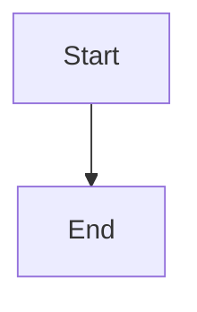

---

## Comments in Mermaid

**Summary:**  
Use \%\% at the beginning of a line. Do NOT use inline comments.

### Code

```text
flowchart TD
    A[Start] --> B[Process]

    %% This is a comment
    B --> C[End]
```

### Output

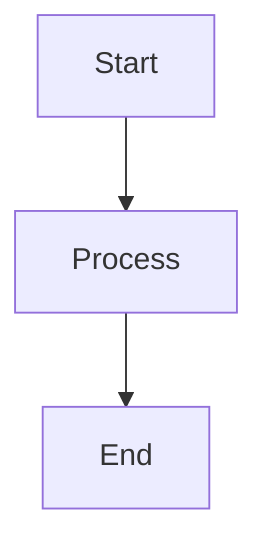

---

## Flowcharts

**Summary:**  
Best for workflows, systems, pipelines, and AI agents.

### Code

```text
flowchart TD
    A[User Query] --> B{Need Tool?}
    B -->|Yes| C[Call API]
    B -->|No| D[Respond Directly]
```

### Output

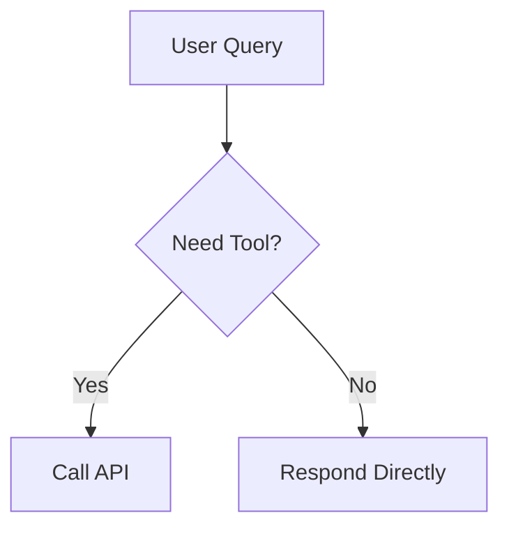

---

## Flow Directions

- TD → Top to Bottom  
- LR → Left to Right  
- RL → Right to Left  
- BT → Bottom to Top  

### Code

```text
flowchart LR
    A --> B
    B --> C
```

### Output

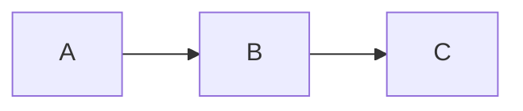

---

## Node Types

### Code

```text
flowchart TD
    A[Rectangle]
    B(Rounded)
    C{Decision}
    D((Circle))
```

### Output

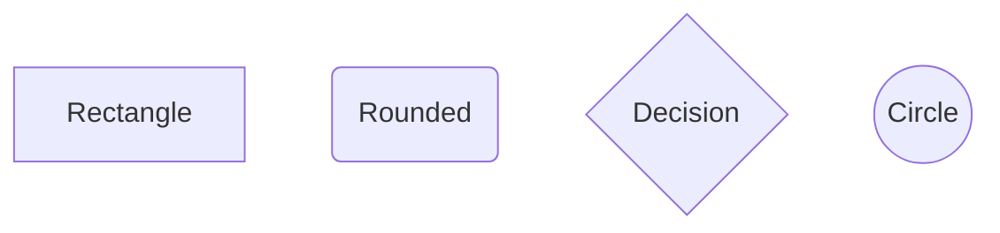

---

## Arrows

### Code

```text
flowchart TD
    A --> B
    B --- C
    C -->|Yes| D
    D -.-> E
```

### Output

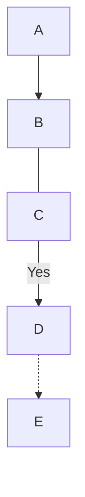

---

## Subgraphs

### Code

```text
flowchart TD
    subgraph Agent
        A[LLM]
        B[Memory]
    end

    User --> A
```

### Output

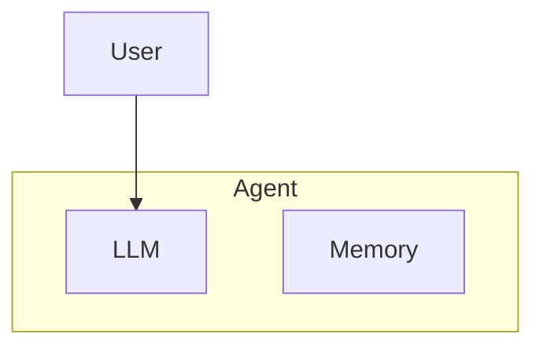

---

## Sequence Diagram

### Code

```text
sequenceDiagram
    participant User
    participant LLM
    participant Tool

    User->>LLM: Ask
    LLM->>Tool: Call API
    Tool-->>LLM: Response
    LLM-->>User: Answer
```

### Output

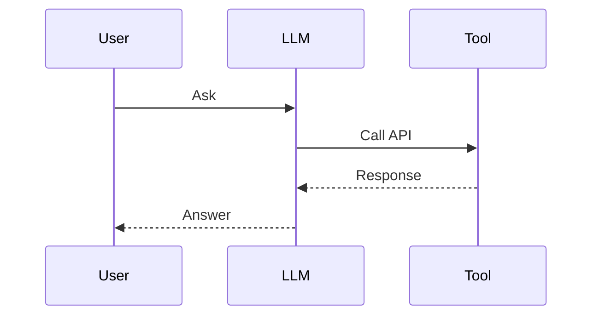

---

## State Diagram

### Code

```text
stateDiagram-v2
    [*] --> Idle
    Idle --> Running
    Running --> Done
```

### Output

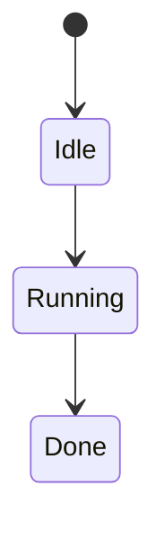

---

## ER Diagram

### Code

```text
erDiagram
    USER ||--o{ ORDER : places
    ORDER ||--|{ ITEM : contains
```

### Output

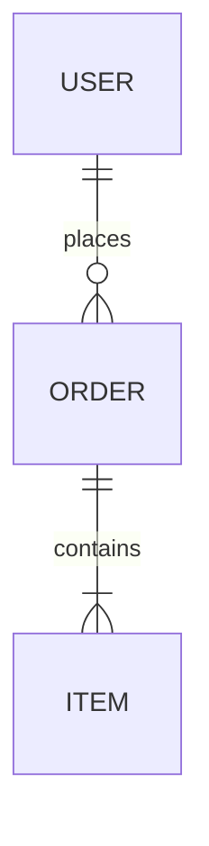

---

## Gantt Chart

### Code

```text
gantt
    title Project Plan
    dateFormat YYYY-MM-DD

    section Build
    Task1 :a1, 2026-01-01, 5d
    Task2 :a2, after a1, 5d
```

### Output

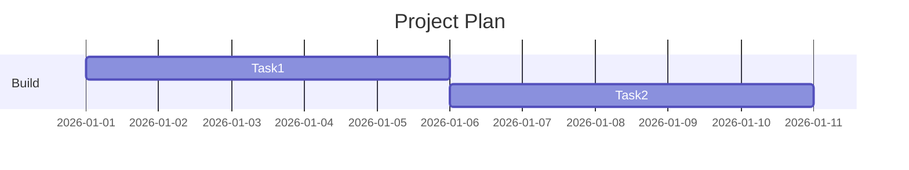

---

## AI Agent Example

### Code

```text
flowchart TD
    A[User Input] --> B[LLM]
    B --> C{Need Tool?}
    C -->|Yes| D[Tool Call]
    D --> B
    C -->|No| E[Final Answer]
```

### Output

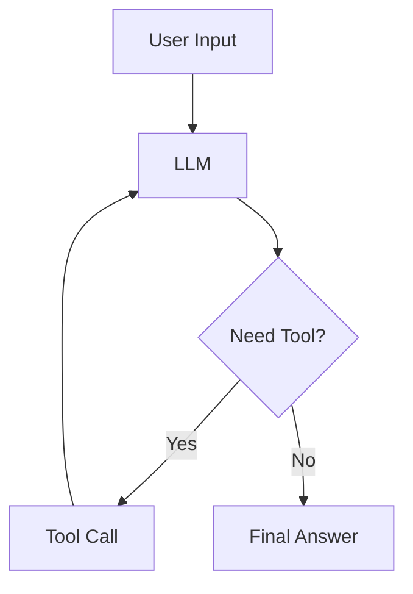

---

## Prompt Chaining Example

### Code

```text
flowchart LR
    A[Input] --> B[Classify]
    B --> C[Extract]
    C --> D[Retrieve]
    D --> E[Generate]
```

### Output

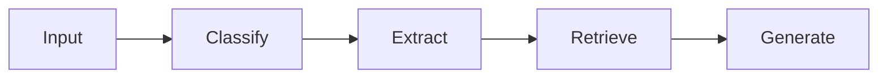

---

## Best Practices

- Do NOT nest code blocks
- Always separate Code and Output
- Keep diagrams simple
- Use labels clearly
- Avoid inline comments

---

## Interview Cram

- Mermaid = diagrams as code
- flowchart = workflows
- sequenceDiagram = interactions
- stateDiagram = lifecycle
- erDiagram = DB design
- gantt = timelines
